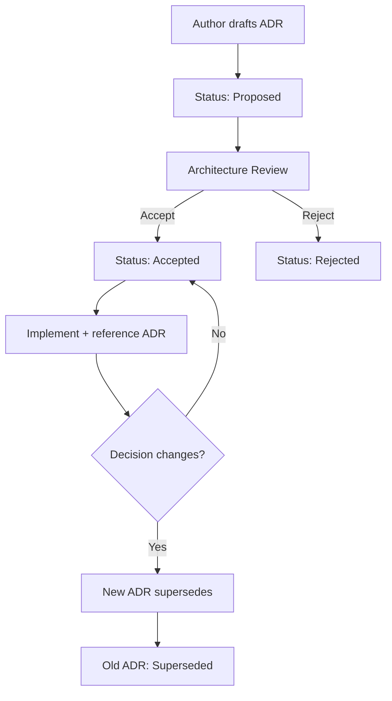

# Architecture Decision Records — Guide

**Status:** Active  
**Scope:** Stankings ecosystem architectural governance

---

## Overview

This guide extends the [ADR README](./adr/README.md) with practical guidance for authoring, reviewing, and maintaining Architecture Decision Records across BamSignal, BayRight, Yike, and future Stankings products.

---

## When to write an ADR

Write an ADR when a decision:

- Affects frozen Foundation contracts
- Introduces a new platform capability (signals, ingestion, API)
- Changes trust, consent, or explainability boundaries
- Establishes a pattern multiple products must follow
- Has significant long-term consequences

Do **not** write ADRs for routine bug fixes, UI tweaks, or product-specific features that do not affect platform contracts.

---

## ADR workflow

---

## Review participants

| Change type | Required reviewers |
|-------------|-------------------|
| Foundation contract | Stankings architecture + all Trust Contributors |
| Trust Signals | Passport platform + emitting products |
| Trust Engine | Passport platform + governance |
| External API | Passport platform + legal/privacy review |
| Product-specific | Product team + architecture acknowledgment |

---

## Relationship to constitution

| Document | Role |
|----------|------|
| **Constitution** | Permanent principles and prohibitions |
| **ADR** | Specific decisions with context and alternatives |
| **Architecture specs** | Detailed technical reference |
| **Code** | Implementation of accepted ADRs |

Constitutional changes require ADR **and** constitution version bump.

---

## Foundation ADRs (accepted)

| ADR | Decision |
|-----|----------|
| ADR-0001 | Passport Foundation v1.0 |
| ADR-0002 | SKL-XXXX-XXXX identifier |
| ADR-0003 | Trust Evolution v1.1 |
| ADR-0004 | Legacy Architecture v1.2 |

---

## Upcoming ADRs (planned)

| ADR | Title | Trigger |
|-----|-------|---------|
| ADR-0005 | Trust Signal Standard | Platform Phase 1 complete |
| ADR-0006 | Signal Contributor Framework | First cross-product signal emission |
| ADR-0007 | Trust Engine Inputs | Trust Engine implementation start |
| ADR-0008 | Consent API | Consent Platform v1.0 |
| ADR-0009 | External Passport API | External integrations |

---

## Supersession rules

1. Never delete accepted ADRs — mark as `Superseded`
2. New ADR must reference the ADR it supersedes
3. Code comments and docs must point to current ADR
4. Breaking changes require migration notes in new ADR

---

## Related documents

- [adr/README.md](./adr/README.md)
- [VERSION_GOVERNANCE.md](./VERSION_GOVERNANCE.md)
- [DIGITAL_TRUST_CONSTITUTION.md](./DIGITAL_TRUST_CONSTITUTION.md)
