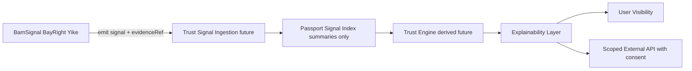
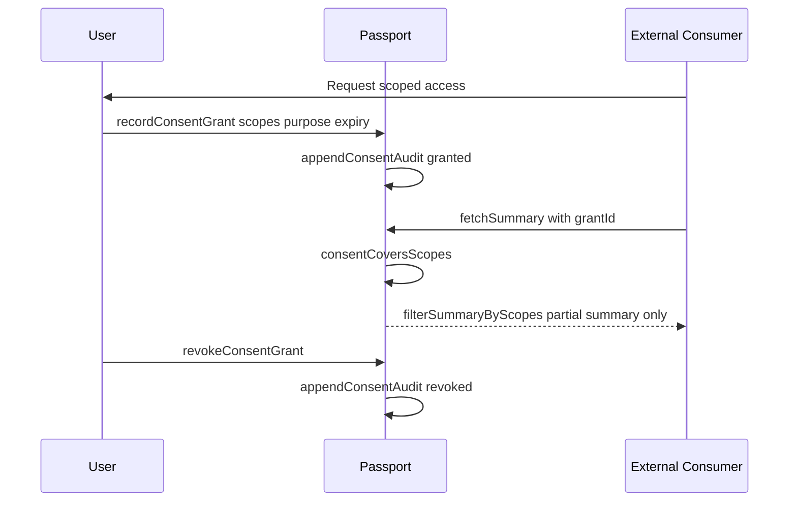
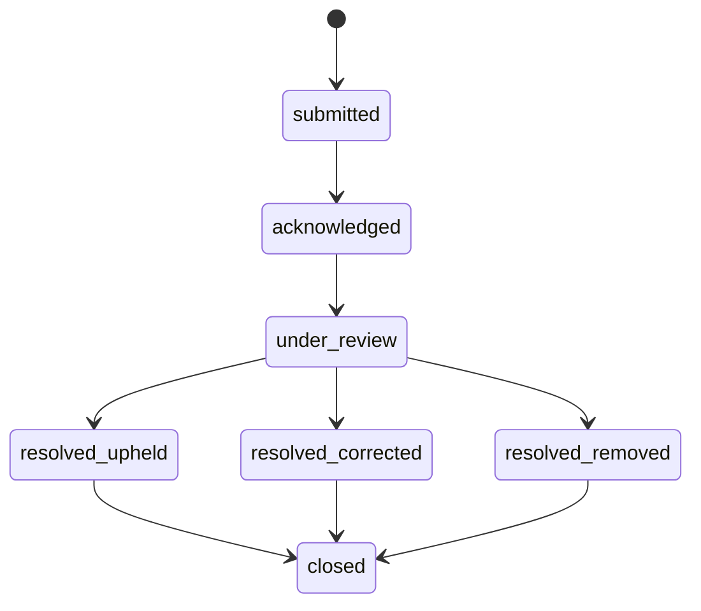
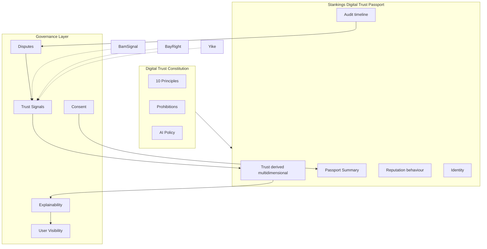

# Stankings Digital Trust Passport — Constitution

**Version:** 1.0.0  
**Status:** Platform governance contract — pre-first-commit  
**Authority:** Stankings ecosystem architecture

---

## Mission

The Stankings Digital Trust Passport is a **transparent trust framework** — not a score that judges people.

It exists to help humans and institutions make **informed decisions** with **explainable, multi-dimensional confidence**, while keeping product data inside the products that own it.

> *"How much confidence should the Stankings ecosystem have in this person?"*  
> Not: *"What is this person's permanent rank?"*

---

## Governance philosophy

The Passport is **Digital Trust Infrastructure**. Future governments, banks, employers, insurers, and marketplaces may rely on it. The architecture must make abuse **difficult by design**:

| We build | We do not build |
|----------|-----------------|
| Transparent trust dimensions | One permanent life score |
| Explainable signal provenance | Opaque black-box rankings |
| Consent-scoped summaries | Raw product data dumps |
| Human oversight hooks | Autonomous judgment |
| Dispute and correction paths | Irreversible labels |

**Technology implements the constitution. The constitution outlives any single product.**

Implementation: `src/passport/governance/constitution.ts`

---

## Constitutional principles

### Principle 1 — One Human, One Passport

Every human owns exactly **one** Stankings Passport.

- Passport IDs are **immutable** (`SKL-XXXX-XXXX`)
- Identity must **never** be duplicated across products
- One anchor → one Passport ID, forever

### Principle 2 — Products Contribute, They Do Not Own

Products **never** own identity.  
Products **never** own trust.  
Products **contribute signals**.  
Passport **derives understanding**.

BamSignal contributes Social Trust. BayRight contributes Financial Trust. Yike contributes Marketplace Trust.

### Principle 3 — Trust Is Explainable

Every trust conclusion must eventually answer:

- Why was this trust level reached?
- What signals contributed?
- Which products contributed?
- Which signals expired or are under review?

No opaque trust calculations. Signal provenance is a first-class requirement.

Implementation: `src/passport/governance/explainability.ts`

### Principle 4 — Trust Is Multi-Dimensional

**Never** reduce a person's entire life into one permanent score.

Current shipped dimensions:

| Dimension | Primary contributors |
|-----------|------------------------|
| Identity Trust | All products |
| Social Trust | BamSignal |
| Financial Trust | BayRight |
| Marketplace Trust | Yike |
| Ecosystem Trust | Stankings hub |

Future dimensions (registry extension, no Passport redesign):

- Professional Trust
- Education Trust
- Health Credentials
- Business Trust

### Principle 5 — Products Own Their Data

Passport owns **summaries**. Products own **details**.

| Passport stores | Products own |
|-----------------|--------------|
| Identity snapshot | Chats, messages |
| Trust summaries | Wallets, transactions |
| Audit references | Listings, marketplace data |
| Participation markers | Medical, learning, employment records |

Implementation: `src/passport/privacy.ts`

### Principle 6 — User Visibility

Users must eventually see:

- Their Passport and Passport ID
- Verification status and identity confidence
- Trust dimensions (independent, not one score)
- Connected products (Trust Contributors)
- Audit history
- Consent grants and data-sharing history
- Trust explanations
- Dispute status

Architecture contract: `buildUserPassportVisibilitySnapshot()` — full UI deferred.

Implementation: `src/passport/governance/userVisibility.ts`

### Principle 7 — Consent by Design

External organizations **never** receive Passport information without appropriate authorization.

Prepared architecture:

- Consent grants with purpose and consumer label
- Expiry and revocation
- Scope-limited access (`PassportApiScope`)
- Consent audit trail
- `consentCoversScopes()` validation before API access

No OAuth flows in this sprint — interfaces only.

Implementation: `src/passport/governance/consent.ts`, `src/passport/externalApi.ts`

### Principle 8 — Right to Challenge

Users may dispute:

- Incorrect verification
- Incorrect moderation
- Incorrect fraud flags
- Incorrect reputation events
- Incorrect trust signals

Disputes require **human review**. Extension points prepared; workflows not implemented.

Implementation: `src/passport/governance/disputes.ts`

### Principle 9 — Human Oversight

Passport **assists** human decision-making. It does **not** autonomously judge people.

Trust dimensions **inform** decisions in employment, credit, insurance, and legal contexts — they do **not** replace human judgment.

Every dispute record carries `requiresHumanReview: true`.

### Principle 10 — Ecosystem First

Every new Stankings product integrates by becoming a **Trust Contributor**:

1. Register in `TRUST_CONTRIBUTOR_REGISTRY`
2. Declare signal types in `TrustSignalTypeRegistration`
3. Bind Passport on auth — never create parallel identity
4. Emit signals — never duplicate trust logic locally

---

## Decision boundaries

The Passport must **never**:

- Assign a single permanent life score
- Manually override trust without audit trail
- Store raw product payloads
- Share data externally without consent or legal basis
- Act as autonomous judge in high-impact contexts
- Operate as opaque black-box trust

Code reference: `PASSPORT_PROHIBITIONS` in `src/passport/governance/constitution.ts`

---

## Trust signal governance

Future trust signals carry metadata — **no scoring, weighting, or algorithms** in this sprint.

| Field | Purpose |
|-------|---------|
| `originProduct` | Which product emitted the signal |
| `occurredAt` / `receivedAt` | Timestamps |
| `category` | verification, behaviour, security, financial, … |
| `verificationStatus` | Signal verification state |
| `confidence` | Signal-level metadata — not a person score |
| `evidenceRef` | Opaque reference — evidence stays in product |
| `expiryPolicy` / `expiresAt` | Temporal bounds |
| `reviewStatus` | Dispute and review linkage |
| `description` | User-facing explainability |

Implementation: `src/passport/governance/trustSignals.ts`



---

## Explainability architecture

Future APIs answer:

- Why is Identity Trust at this level?
- Which products contributed?
- Which verification events influenced this?
- Which signals are expired?
- Which are pending review or disputed?

```typescript
TrustDimensionExplanation {
  dimension, confidence, headline, summary,
  contributingProducts, factors,
  expiredFactors, pendingReviewFactors, disputedFactors
}
```

Placeholder until signals ship: `buildPlaceholderTrustExplanation()`

**Principle 9 notice** included in every explanation payload: explanations assist humans; they do not replace judgment.

---

## Consent architecture



External consumers receive **summaries only** — never raw chats, wallets, or medical records.

---

## Dispute architecture



Disputes link to:

- Trust signals (`targetType: trust_signal`)
- Audit events
- Verification records
- Reputation events

Human review is **mandatory** — no automated dispute resolution.

---

## Future AI usage policy

AI may **assist** the Passport platform. AI must **not** judge people autonomously.

| Allowed (with audit) | Prohibited |
|---------------------|------------|
| Dispute triage assistance | Autonomous credit/employment/legal decisions |
| Plain-language explanation summaries | Single-score person ranking |
| Anomaly detection for human investigation | Trust overrides without review |
| | Training on raw product data without consent |

Code reference: `AI_USAGE_POLICY` in `src/passport/governance/index.ts`

---

## Ethical guidelines

1. **Dignity first** — Trust informs; it does not define human worth.
2. **Transparency** — If a user cannot understand why, the architecture is incomplete.
3. **Proportionality** — Collect minimum signals required for the stated purpose.
4. **Recourse** — Every consequential signal must be disputable.
5. **Separation** — Product behaviour stays in products; Passport indexes trust.
6. **No permanent labels** — Signals expire; disputes correct errors.
7. **Ecosystem accountability** — Contributors register signals; Passport audits provenance.

---

## Trust maturity levels

Every capability declares its maturity in **`PASSPORT_CAPABILITY_REGISTRY`**.  
Advance maturity here — do not invent parallel status flags.

| Level | Meaning |
|-------|---------|
| **Production** | Authoritative platform contract — safe for ecosystem reliance |
| **Beta** | Shipped but evolving — may change with notice |
| **Foundation** | Interfaces and architecture only — not authoritative for trust decisions |
| **Planned** | Roadmap entry — not implemented |

| Capability | Maturity |
|------------|----------|
| Identity | Production |
| Passport ID | Production |
| Workspace | Production |
| Persona | Production |
| Permissions | Production |
| Passport Summary | Production |
| Trust Contributors | Production |
| Constitution | Production |
| Audit Timeline | Beta |
| Behaviour Reputation | Foundation |
| Identity Trust | Foundation |
| Social Trust | Foundation |
| Trust Signals | Foundation |
| Explainability | Foundation |
| Consent | Foundation |
| Disputes | Foundation |
| User Visibility | Foundation |
| Financial Trust | Planned |
| Marketplace Trust | Planned |
| Ecosystem Trust | Planned |
| Trust Engine | Planned |
| External API | Planned |
| Consent UI | Planned |
| Dispute Workflow | Planned |

Implementation: `src/passport/governance/maturity.ts`

Only **Production** capabilities (`isAuthoritativeCapability()`) may be treated as authoritative by external consumers.

---

## Architecture diagram



---

## Code map

| Governance concern | Module |
|--------------------|--------|
| Constitutional principles | `src/passport/governance/constitution.ts` |
| Trust signal metadata | `src/passport/governance/trustSignals.ts` |
| Explainability | `src/passport/governance/explainability.ts` |
| Consent | `src/passport/governance/consent.ts` |
| Disputes | `src/passport/governance/disputes.ts` |
| User visibility | `src/passport/governance/userVisibility.ts` |
| **Maturity registry** | `src/passport/governance/maturity.ts` |
| Public exports | `src/passport/governance/index.ts` |

---

## Platform contracts (Foundation v1.0)

The following are **frozen platform contracts** after the foundation release. Changes require explicit architectural review:

| Contract | Canonical definition |
|----------|---------------------|
| Product name | **Stankings Digital Trust Passport** |
| Passport ID format | **`SKL-XXXX-XXXX`** |
| Individual namespace | **`SKL` = Stankings Legacy** |
| Prefix registry | `PASSPORT_PREFIX_REGISTRY` (SKL active; SKB, SKO, SKG, SKA reserved) |
| Identity model | One human, one Passport |
| Workspace model | Operating context registry |
| Persona model | Appearance within workspace |
| Permission model | Identity, persona, workspace gates |
| Trust model | Multi-dimensional, no single score |
| Trust Contributor model | Products contribute signals |
| Passport Summary schema | Portable trust summaries only |
| Consent model | Scoped, expiring, revocable |
| Explainability model | Every conclusion must be explainable |
| Constitutional principles | Ten principles + prohibitions |

Specification: [PASSPORT_IDENTIFIER_STANDARD.md](./PASSPORT_IDENTIFIER_STANDARD.md)

---

## Evaluating future features

Before any feature ships, ask:

1. Does it violate a constitutional principle?
2. Does it introduce a single opaque score?
3. Does it duplicate product-owned data in Passport?
4. Does it bypass consent for external access?
5. Does it remove explainability or dispute paths?
6. Does it replace human judgment in high-impact contexts?

If **yes** to 2–6, the feature must be redesigned or rejected.

---

## Related documents

- [PASSPORT_IDENTIFIER_STANDARD.md](./PASSPORT_IDENTIFIER_STANDARD.md) — Passport ID format (SKL)
- [STANKINGS_PASSPORT.md](./STANKINGS_PASSPORT.md) — platform overview
- [DIGITAL_TRUST_MODEL.md](./DIGITAL_TRUST_MODEL.md) — trust, reputation, contributors
- [IDENTITY_ARCHITECTURE.md](./IDENTITY_ARCHITECTURE.md) — workspace, persona, permissions

---

## Amendment policy

Constitutional changes require:

1. Documentation update in this file
2. Version bump (`CONSTITUTION_VERSION`)
3. Architecture review across all Trust Contributors
4. Backward compatibility assessment for existing Passport IDs and sessions

**No silent constitutional drift.**
