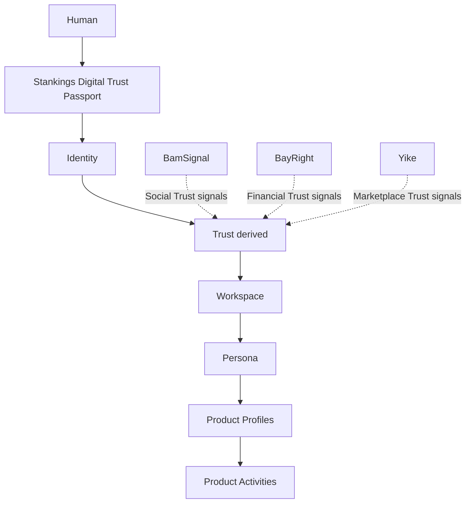
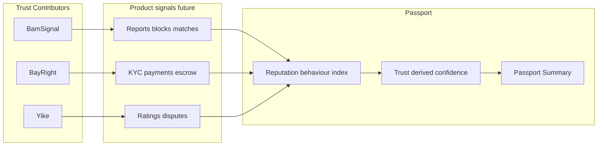

# Digital Trust Model

**Status:** Foundational architecture — interfaces only, no scoring  
**Scope:** Platform contract for the Stankings ecosystem

---

## Philosophy

The Stankings Passport is **not**:

- Another user profile
- Another authentication system
- Another KYC record
- A credit bureau
- A reputation engine

It is the person's lifelong **Stankings Digital Trust Passport**.

Every person has exactly **one** Passport.  
Every product **contributes** trust signals.  
**No product owns** the Passport.  
Every product **consumes** the Passport.

---

## Layer model

```
Human
  ↓
Passport
  ↓
Identity        — Who is this person?
  ↓
Trust           — How confident are we? (derived, never manually assigned)
  ↓
Workspace       — Where are they operating?
  ↓
Persona         — How do they appear?
  ↓
Permissions     — What can they do? (client UI gates)
  ↓
Product Profiles — Product-specific data shells
  ↓
Product Activities — Chats, wallets, listings (product-owned)
```

| Layer | Question |
|-------|----------|
| Identity | Who is this person? |
| Trust | How confident is the ecosystem? |
| Reputation | How has this person behaved? |
| Audit | What happened over time? |

**Trust** and **Reputation** are **independent** — never conflated.

---

## Identity

Represents the human.

Owns:

- Passport ID (immutable)
- Username, email(s), phone(s)
- Verification state
- Identity confidence (not a trust score)
- Security state

Implementation: `src/passport/session.ts`, `src/passport/types.ts`

---

## Trust

Represents **derived confidence**.

- **NOT** calculated in this sprint
- **NEVER** manually assigned
- Always **derived** from contributor signals (future)

### Trust dimensions

| Dimension | Primary contributors |
|-----------|---------------------|
| Identity Trust | BamSignal, BayRight, Yike, Government (future) |
| Social Trust | BamSignal |
| Financial Trust | BayRight |
| Marketplace Trust | Yike |
| Ecosystem Trust | Stankings hub, cross-product |

Implementation: `src/passport/trust/`

```typescript
getTrustSnapshot()       // All dimensions — confidence: "pending"
listTrustDimensions()    // Registry list
getTrustDimensionSummary("social_trust")
```

---

## Reputation

Represents **behaviour** — distinct from Trust.

Extension points only:

| Behaviour dimension | Example signals (future) |
|----------------------|--------------------------|
| Community | Reports, blocks, safety incidents |
| Marketplace | Seller/buyer ratings, disputes |
| Financial | Payment behaviour, chargebacks |
| Professional | Employment, references |
| Education | Credentials, affiliations |
| Product | Product-specific behaviour markers |

Implementation: `src/passport/reputation/`

Products emit **behaviour signals** → Passport indexes summaries → Trust engine **derives** Trust (future).

---

## Audit timeline

Represents **history**.

Categories: authentication, verification, moderation, security, workspace, persona, profile, product, **transaction**, report.

- Stores **references** and metadata — not raw product payloads
- Extension point for cross-product timeline

Implementation: `src/passport/audit.ts`

---

## Trust Contributors

Products are **Trust Contributors**, not identity owners.

Registry: `src/passport/trust/contributors/registry.ts`

| Contributor | Shipped | Trust contributions | Reputation types |
|-------------|---------|---------------------|------------------|
| BamSignal | ✓ | Social, Identity | Community, Product |
| BayRight | Reserved | Financial, Identity | Financial, Professional |
| Yike | Reserved | Marketplace, Identity | Marketplace, Product |
| Stankings | Reserved | Ecosystem | Product |
| Education, Healthcare, Employment, Travel, Government | Reserved | Various | Various |

### Adding a contributor

1. Add entry to `TRUST_CONTRIBUTOR_REGISTRY`
2. Register `trustContributions`, `reputationTypes`, `auditCategories`
3. List `preparedSignals` (not collected yet)
4. Call `bindPassportIdentity({ productId })` on product auth
5. Emit audit events via `appendPassportAuditEvent`

**No Passport redesign required.**

---

## Passport Summary

Canonical portable object — **no raw product data**.

```typescript
buildPassportSummary(): PassportSummary
```

Structure:

```typescript
{
  passportId: "SKL-4A7D-9XQ2",
  identity: {
    displayName, verificationStatus, identityConfidence, securityStatus
  },
  trust: { identity_trust, social_trust, ... },  // summaries only
  products: { active, verificationParticipation },
  timeline: { memberSince, lastActive, recentSecurityEvents },
  generatedAt
}
```

This becomes the standard object consumed across Stankings products.

---

## Privacy architecture

Passport stores **only**:

- Identity
- Trust summaries
- Trust dimension metadata
- Audit references
- Product participation markers

Products **continue to own**:

- Chats, messages, media, signals
- Wallets, transactions, financial records
- Listings, marketplace data
- Preferences, relationship history

Implementation: `src/passport/privacy.ts`

```typescript
assertNotProductOwnedPayload("chats")  // dev guard
PRODUCT_DATA_OWNERSHIP                 // registry reference
```

The Passport **indexes trust**. It does **not** duplicate product databases.

---

## External API architecture (prepared)

Interfaces only — **no HTTP implementation**.

Future consumers (with consent / legal basis):

- Government agencies (where authorized)
- Credit bureaus
- Financial institutions
- Employers, insurance, education, marketplace partners

```typescript
interface PassportExternalApiClient {
  fetchSummary(context: PassportApiRequestContext): Promise<PassportApiResult<PassportSummary>>;
}

filterSummaryByScopes(summary, scopes)  // privacy enforcement at API boundary
```

Scopes: `identity.summary`, `trust.summary`, `trust.dimension.*`, `products.participation`, `audit.recent`

Local stub: `localPassportApiClient` (development only)

---

## Architecture diagrams

### Digital Trust flow



### Trust vs Reputation



---

## Future scoring strategy

This sprint establishes **interfaces only**:

1. Products register as Trust Contributors
2. Products emit typed signals (future API)
3. Passport audit timeline records events
4. Trust engine derives dimension confidence (future service)
5. Passport Summary exposes high-level trust to consumers
6. External API serves scoped summaries with consent

**No scores are calculated in BamSignal client code.**

---

## Code map

| Concern | Path |
|---------|------|
| Trust dimensions | `src/passport/trust/` |
| Trust contributors | `src/passport/trust/contributors/registry.ts` |
| Behaviour reputation | `src/passport/reputation/` |
| Passport Summary | `src/passport/summary.ts` |
| External API interfaces | `src/passport/externalApi.ts` |
| Privacy boundaries | `src/passport/privacy.ts` |
| Audit timeline | `src/passport/audit.ts` |

---

## Related

- **[DIGITAL_TRUST_CONSTITUTION.md](./DIGITAL_TRUST_CONSTITUTION.md)** — constitutional governance (governing document)
- [STANKINGS_PASSPORT.md](./STANKINGS_PASSPORT.md) — platform overview
- [IDENTITY_ARCHITECTURE.md](./IDENTITY_ARCHITECTURE.md) — workspace, persona, permissions
