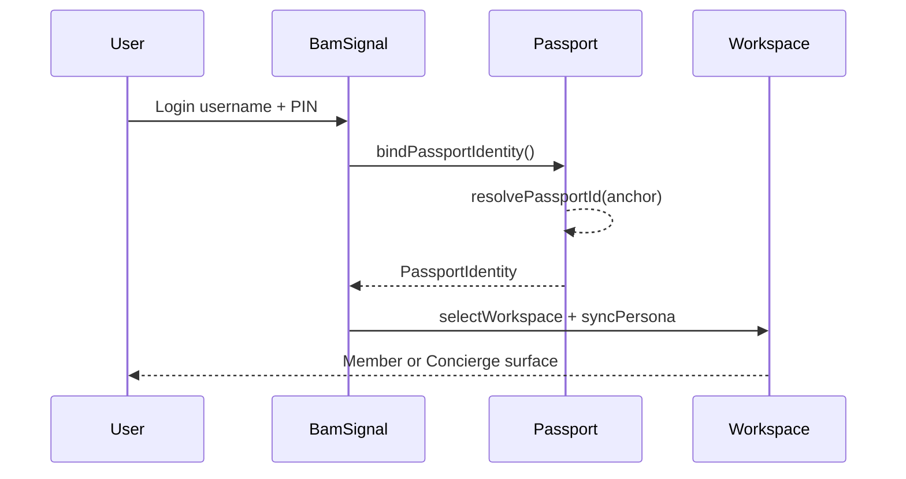
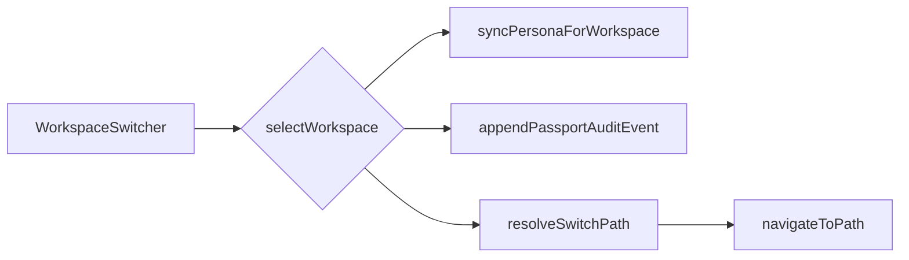

# Identity Architecture

**Repository:** BamSignal (first Stankings Passport consumer)  
**Status:** Foundational sprint — client architecture only

---

## Overview

BamSignal authentication, workspace switching, and Concierge separation are consolidated under the **Stankings Digital Trust Passport** model.

Hierarchy (permanent):

```
Passport → Identity → Workspace → Persona → Permissions → Product Profile
```

---

## Identity model

**Identity = the human.** One identity maps to one Passport ID.

| Property | Source | Mutable |
|----------|--------|---------|
| Passport ID | Passport registry | No |
| Username | Auth / profile | Yes (with cooldown) |
| Email / phone | Auth / profile | Yes |
| Verification status | Derived client snapshot | Yes |
| Security status | Prepared (`normal` / `review` / `restricted`) | Yes |

Identity is **never duplicated**. Member and Concierge share one Passport.

API: `bindPassportIdentity()`, `getPassportIdentity()` — `src/passport/session.ts`

---

## Workspace model

**Workspace = where the user operates.**

Registry-driven (`src/workspaces/registry.ts`):

| Workspace | Shipped | Base path |
|-----------|---------|-----------|
| Member | Yes | `/home` |
| Concierge | Yes | `/concierge` |
| Admin | Reserved | `/hard` |
| Moderator | Reserved | `/moderator` |
| Support | Reserved | `/support-desk` |
| Vendor | Reserved | `/vendor` |

Workspaces belong to the Passport session — not isolated role flags.

### Navigation isolation

- **Member:** bottom nav + member fintech shell (frozen).
- **Concierge:** editorial shell + Concierge header nav.
- **Shared:** `WorkspaceSwitcher` only when ≥2 workspaces available.

---

## Persona model

**Persona = how the user appears inside a workspace.**

Registry: `src/passport/personas/registry.ts`

| Persona | Workspace | Default | Shipped |
|---------|-----------|---------|---------|
| Dating Member | member | Yes | Yes |
| Premium Member | member | No | Yes |
| Premium Concierge | concierge | Yes | Yes |
| Administrator | admin | Yes | No |
| Moderator | moderator | Yes | No |
| Support Agent | support | Yes | No |
| Vendor | vendor | Yes | No |
| Ambassador | member | No | No |

Persona auto-syncs on workspace selection via `syncPersonaForWorkspace()`.

---

## Permission model

Centralized client helpers — **server authorization unchanged**.

```typescript
identityCan("identity.edit.username")  // Passport identity
workspaceCan("workspace.switch")       // Selected workspace
personaCan("persona.profile.edit")     // Selected persona
```

| Layer | Module |
|-------|--------|
| Identity | `src/passport/permissions.ts` |
| Workspace | `src/workspaces/permissions.ts` |
| Persona | `src/passport/personaPermissions.ts` |

---

## Product profile separation

Passport Identity ≠ BamSignal product data.

```typescript
// src/passport/profiles.ts
BamSignalMemberProfile   { passportId, user, dating }
BamSignalConciergeProfile { passportId, applicationStatus, ... }
```

Products store activity (chats, signals, preferences). Passport stores who the person is.

---

## Reputation model (prepared)

**Behaviour reputation** is distinct from **Trust**. See [DIGITAL_TRUST_MODEL.md](./DIGITAL_TRUST_MODEL.md).

Behaviour dimensions: community, marketplace, financial, professional, education, product.

API: `getReputationSnapshot()` — `src/passport/reputation/`

---

## Trust model (prepared)

Trust dimensions: identity_trust, social_trust, financial_trust, marketplace_trust, ecosystem_trust.

API: `getTrustSnapshot()`, `buildPassportSummary()` — `src/passport/trust/`, `src/passport/summary.ts`

Trust is **derived** — never manually assigned. Not calculated in this sprint.

---

## Audit timeline

Client-side extension points for ecosystem history:

Categories: authentication, verification, moderation, report, security, profile, workspace, persona, product.

API:

- `appendPassportAuditEvent({ category, action, ... })`
- `getPassportAuditTimeline()`

Future: sync to Stankings Digital Trust Passport service when backend ships.

---

## Session model

Persisted in Passport session:

| Key | Purpose |
|-----|---------|
| `passportId` | Immutable reference |
| `selectedWorkspaceId` | Current workspace |
| `preferredWorkspaceId` | Login restore preference |
| `availableWorkspaceIds` | Unlocked workspaces |
| `lastPathByWorkspace` | Deep link / refresh restore |
| `selectedPersonaId` | Current persona |
| `preferredPersonaId` | Persona preference |
| `lastRoute` | Global last route |

Post-auth: Concierge auth never redirects to member `/home`. Workspace preference respected via `resolvePostAuthWorkspacePath()`.

---

## Settings UI

**Settings → Stankings Identity** (`PassportIdentityPanel`):

- Passport ID
- Username, email, phone
- Verification status
- Current workspace + persona
- Workspace switcher (multi-workspace only)
- Reputation placeholder

---

## Diagrams

### Identity flow



### Workspace switch



---

## Future ecosystem integration

| Product | Integration step |
|---------|------------------|
| BamSignal | **Done** — first consumer |
| BayRight | `bindPassportIdentity({ productId: "bayright" })` + workspace registry |
| Yike | Same pattern |
| Stankings | Same Passport ID across products |

When the Stankings Digital Trust Passport becomes a platform service, client stores sync upward; local registries become read replicas of server truth.

---

## Validation checklist

- [x] Existing users auto-map to Passport on bind
- [x] Concierge auth unchanged (dedicated routes)
- [x] Workspace switcher preserved
- [x] No Supabase/API changes
- [ ] Cross-device Passport sync (future — requires platform service)
- [ ] Server-side persona entitlements (future)

---

## Files reference

See [STANKINGS_PASSPORT.md](./STANKINGS_PASSPORT.md) for module map and storage keys.

See [DIGITAL_TRUST_CONSTITUTION.md](./DIGITAL_TRUST_CONSTITUTION.md) for governing principles and ethics.

See [DIGITAL_TRUST_MODEL.md](./DIGITAL_TRUST_MODEL.md) for trust, reputation, contributors, and privacy.
