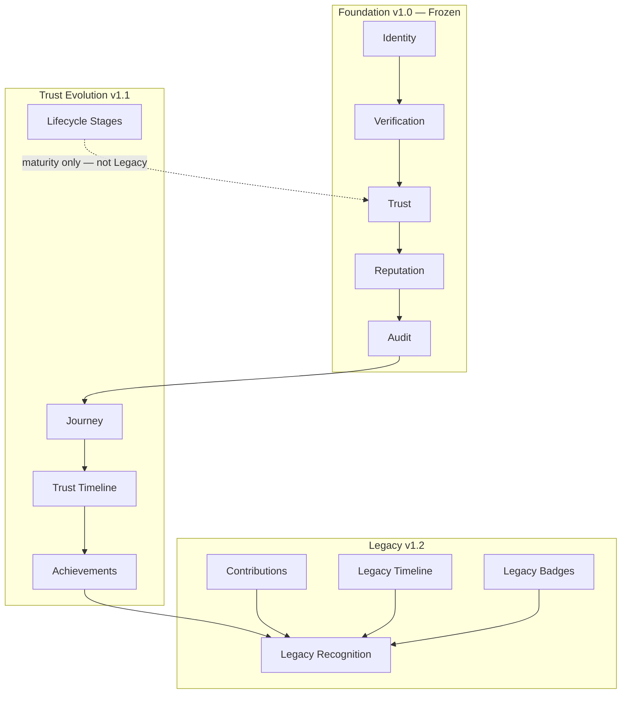

# Stankings Digital Trust Passport — Legacy Architecture

**Version:** 1.2  
**Status:** Legacy layer — completes the conceptual Passport foundation  
**Foundation:** Frozen contracts in [DIGITAL_TRUST_CONSTITUTION.md](./DIGITAL_TRUST_CONSTITUTION.md)  
**Evolution:** Extends [TRUST_EVOLUTION_MODEL.md](./TRUST_EVOLUTION_MODEL.md) (v1.1)

---

## Why Legacy exists

After years — even decades — of trustworthy participation, a person is no longer simply "Trusted."

They have built a **Legacy**.

Legacy is what remains after sustained positive contribution across the Stankings ecosystem:

- thousands of successful marketplace transactions
- decades of clean financial history
- years of community participation
- multiple businesses
- government verification
- educational credentials
- family verification
- no fraud history

Legacy is not earned by a single action. It is **accumulated over time**.

---

## Principle 12 — Legacy Is Built

A Passport should recognize sustained positive contribution over time.

| Legacy must | Legacy must never |
|-------------|-------------------|
| Emerge from verified participation | Be purchased |
| Reflect responsible conduct | Be granted arbitrarily |
| Honor meaningful contribution | Be inherited |
| Represent enduring trust | Be calculated as a direct score |
| Represent stewardship | Replace trust dimensions |

Implementation: `CONSTITUTIONAL_PRINCIPLES` (Principle 12) in `src/passport/governance/constitution.ts`

Philosophy constants: `LEGACY_PHILOSOPHY`, `LEGACY_EMERGENCE_PHILOSOPHY` in `src/passport/legacy/philosophy.ts`

---

## Complete architecture stack

Legacy is the **final permanent layer** — distinct from Lifecycle, Timeline, and Achievements.

```text
Human
  ↓
Identity
  ↓
Verification
  ↓
Trust
  ↓
Reputation
  ↓
Audit
  ↓
Journey
  ↓
Timeline
  ↓
Achievements
  ↓
Legacy
  ↓
Digital Trust Passport
```

Implementation: `PASSPORT_ARCHITECTURE_LAYERS` in `src/passport/legacy/model.ts`



---

## Conceptual distinctions

These concepts are **different**. They must never be conflated.

| Concept | Question | Horizon | Nature |
|---------|----------|---------|--------|
| **Lifecycle** | What maturity stage? | Months to years | Descriptive stage — ends at Distinguished |
| **Trust Timeline** | How did trust evolve? | Years | Curated positive milestones |
| **Audit** | What happened? | Complete | Full event history |
| **Achievements** | What positive badges? | Any | Do not affect trust directly |
| **Legacy Timeline** | What enduring contribution story? | Decades | Long-horizon narrative |
| **Legacy Badges** | What sustained recognition? | Decades | Stewardship — not achievements |
| **Legacy Contributions** | What has this person contributed? | Lifelong | Contribution dimensions — not trust |
| **Legacy** | What remains after decades? | Lifelong | Emerges — never calculated directly |

---

## Legacy is never calculated directly

Legacy **emerges**. It is not another score.

Lifecycle stages communicate maturity (they end at **Distinguished** — not Legacy):

```text
Anonymous
  ↓
Registered
  ↓
Verified
  ↓
Trusted
  ↓
Established
  ↓
Distinguished
```

Legacy recognition is **separate** from lifecycle. A Distinguished participant may still have `not_yet_emerged` Legacy status until decades of contribution are verified.

Implementation: `PASSPORT_LIFECYCLE_STAGES` in `src/passport/evolution/lifecycle.ts` (no `legacy` stage)

---

## Legacy Contributions

Every Passport should eventually answer:

> What has this person contributed?

| Dimension | Description |
|-----------|-------------|
| Community | Sustained positive community participation |
| Business | Responsible business creation and stewardship |
| Marketplace | Marketplace participation and merchant integrity |
| Education | Educational contribution and credentials |
| Employment | Professional employment and employer trust |
| Innovation | Innovation and ecosystem advancement |
| Public Service | Public service and civic contribution |
| Family | Family verification and intergenerational stewardship |
| Leadership | Leadership within communities or organizations |
| Mentorship | Guidance to others in the ecosystem |
| Volunteerism | Volunteer contribution without commercial incentive |

These are **Legacy dimensions** — not trust dimensions.

Implementation: `LEGACY_CONTRIBUTION_REGISTRY` in `src/passport/legacy/contributions.ts`

---

## Legacy Timeline

Different from the Trust Timeline. Decades-scale contribution narrative.

Example:

```text
2026 — Passport created
2027 — Verified Identity
2028 — First Marketplace Business
2031 — 1000 Successful Transactions
2034 — Founded Organization
2038 — Recognized Community Builder
2042 — Legacy Status emerged
```

Implementation: `src/passport/legacy/timeline.ts`

| Category | Meaning |
|----------|---------|
| `passport_created` | Passport bound |
| `identity_verified` | Core identity verification |
| `first_business` | First responsible business |
| `marketplace_milestone` | Sustained marketplace integrity |
| `organization_founded` | Organization stewardship |
| `community_recognition` | Community builder recognition |
| `contribution_recognized` | Contribution dimension recognized |
| `legacy_status_emerged` | Legacy recognition emerged |

---

## Legacy Badges

Not achievements. **Legacy recognition.**

| Badge | Meaning |
|-------|---------|
| Founder | Founded a lasting business or organization |
| Pioneer | Early trusted participant in a domain |
| Mentor | Recognized mentorship over many years |
| Builder | Enduring community, marketplace, or institutional contribution |
| Visionary | Innovation that advanced the trust ecosystem |
| Community Pillar | Decades of positive community stewardship |
| Trusted Merchant | Sustained marketplace integrity |
| Trusted Employer | Employment stewardship and workforce trust |
| Trusted Institution | Institutional contribution over long horizons |
| National Contributor | Contribution at national ecosystem scale |

Every badge carries `isTrustScore: false`. Human review is mandatory for recognition.

Implementation: `LEGACY_BADGE_REGISTRY` in `src/passport/legacy/badges.ts`

---

## Legacy Model

`LegacySnapshot` is the portable Legacy object — references only, no raw product data.

| Field | Purpose |
|-------|---------|
| `status` | `not_yet_emerged`, `emerging`, `recognized`, `under_review` |
| `contributionSummary` | Human-readable — what has this person contributed? |
| `contributions` | Indexed contribution records |
| `badges` | Human-reviewed legacy recognition |
| `timeline` | Decades-scale narrative |
| `derived` | Always `false` in client — Legacy never calculated in product code |

Implementation: `buildPlaceholderLegacySnapshot()` in `src/passport/legacy/model.ts`

---

## Legacy APIs (interfaces only)

No scoring. No AI decisions. No authentication changes. No Trust Engine changes.

| Method | Purpose |
|--------|---------|
| `getLegacySnapshot` | Portable Legacy summary |
| `getLegacyTimeline` | Decades-scale timeline |
| `listContributions` | Contribution records |
| `listBadges` | Legacy badge records |
| `submitRecognition` | Human-reviewed recognition submission |
| `appendTimelineEvent` | Append long-horizon event |

Interface: `LegacyApiClient` in `src/passport/legacy/api.ts`

Placeholder: `legacyApiClientPlaceholder` — returns empty / not-yet-emerged state.

---

## User visibility (future dashboard)

Architecture contract for future Passport dashboard sections:

- Legacy
- Legacy Contributions
- Legacy Timeline
- Legacy Badges

No UI in this sprint — `buildUserPassportVisibilitySnapshot()` extended.

Implementation: `src/passport/governance/userVisibility.ts`

---

## AI governance

AI may **assist** in identifying patterns for human review.

AI must **never** become the final authority for Legacy recognition.

Human oversight remains **mandatory** for all Legacy badge grants.

Implementation: `AI_USAGE_POLICY` in `src/passport/governance/index.ts`

---

## SKL philosophy

**SKL = Stankings Legacy** — the individual Passport namespace encodes the lifelong vision:

A digital trust and contribution record where participation, consistency, and meaningful contribution build explainable confidence over decades — without permanent labels from isolated mistakes, and with Legacy as the final layer of stewardship recognition.

See [PASSPORT_IDENTIFIER_STANDARD.md](./PASSPORT_IDENTIFIER_STANDARD.md).

---

## Code map

| Concern | Module |
|---------|--------|
| Legacy philosophy | `src/passport/legacy/philosophy.ts` |
| Contribution registry | `src/passport/legacy/contributions.ts` |
| Legacy badges | `src/passport/legacy/badges.ts` |
| Legacy Timeline | `src/passport/legacy/timeline.ts` |
| Legacy Model | `src/passport/legacy/model.ts` |
| Legacy APIs | `src/passport/legacy/api.ts` |
| Public exports | `src/passport/legacy/index.ts` |
| Governance exports | `src/passport/governance/index.ts` |

---

## Maturity (v1.2 capabilities)

| Capability | Maturity |
|------------|----------|
| Legacy | Foundation |
| Legacy Contributions | Foundation |
| Legacy Timeline | Foundation |
| Legacy Recognition (badges) | Foundation |
| Legacy API | Planned |

See `PASSPORT_CAPABILITY_REGISTRY` in `src/passport/governance/maturity.ts`

---

## Related documents

- [DIGITAL_TRUST_CONSTITUTION.md](./DIGITAL_TRUST_CONSTITUTION.md) — Principle 12, prohibitions
- [TRUST_EVOLUTION_MODEL.md](./TRUST_EVOLUTION_MODEL.md) — lifecycle, trust timeline, achievements
- [STANKINGS_PASSPORT.md](./STANKINGS_PASSPORT.md) — platform overview
- [PASSPORT_IDENTIFIER_STANDARD.md](./PASSPORT_IDENTIFIER_STANDARD.md) — SKL format

---

## Amendment note

This document **extends** Foundation v1.0 and Trust Evolution v1.1. It does **not** modify:

- `SKL-XXXX-XXXX` Passport ID format
- Identity, Workspace, Persona, Permission models
- Trust Contributor registry
- Passport Summary schema
- Constitutional principles 1–10
- Trust Engine contract (interfaces only)
- Lifecycle stages (Legacy removed from lifecycle in v1.2)

Constitution version bumped to **1.2.0** for Principle 12 and Legacy architecture only.

With Legacy in place, the **Stankings Digital Trust Passport Foundation** is architecturally complete. Subsequent work — trust signals, server-side ingestion, consent UI, BayRight integration, Yike integration, analytics, APIs — is implementation built on this stable foundation.
