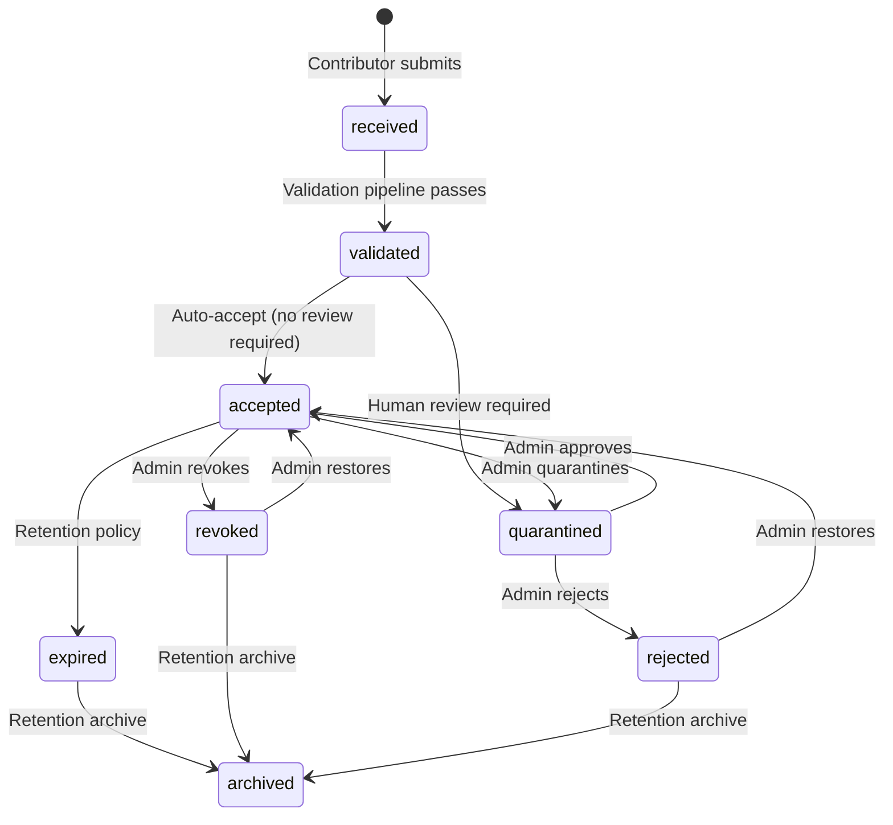
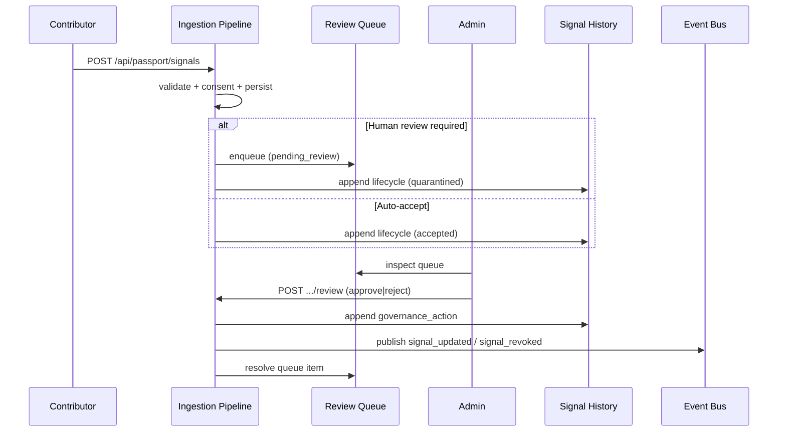
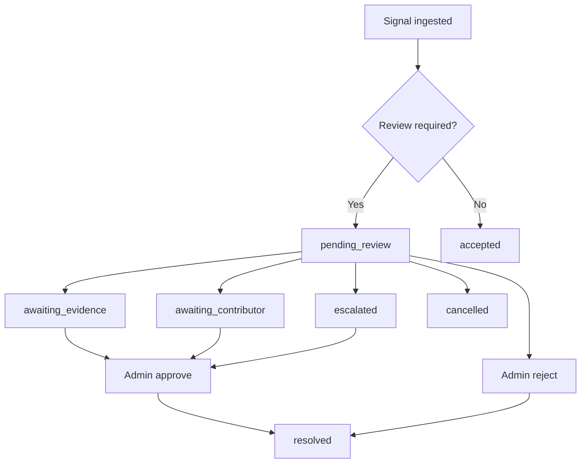
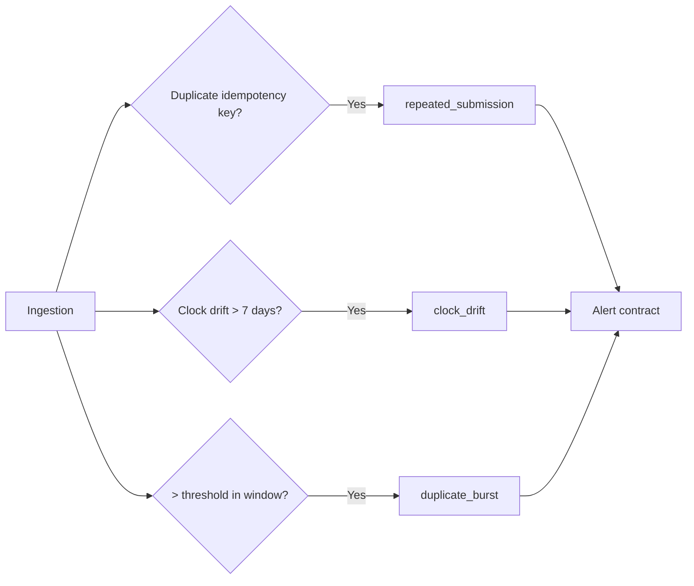

# Signal Governance & Operations

**Platform Phase 3 — Platform v2.2**  
**Status:** Foundation (operational layer implemented; production maturity after deployment stability)

---

## Purpose

Trust Signals enter the platform through ingestion (Platform v2.1). This document defines the **operational governance layer** required to run signals safely in production — without Trust Engine, scoring, or AI decisions.

Signals are evidence. Governance is operations.

---

## Operational Philosophy

1. **Governance ≠ Trust** — lifecycle management, review, and contributor health never influence trust scores
2. **Human review is authoritative** — automation may quarantine; humans approve or reject
3. **Nothing silent** — every action produces audit record, governance event, and history entry
4. **Never hard-delete** — rejected, revoked, and archived signals remain auditable
5. **Append-only history** — lifecycle changes are recorded, never overwritten

---

## Signal Lifecycle

### Lifecycle statuses

| Status | Description | Terminal |
|--------|-------------|----------|
| `received` | Signal received from contributor | No |
| `validated` | Passed validation pipeline | No |
| `accepted` | Accepted for platform use | No |
| `quarantined` | Held pending governance review | No |
| `rejected` | Rejected by governance | Yes |
| `revoked` | Revoked after acceptance | Yes |
| `expired` | Expired per retention policy | Yes |
| `archived` | Archived — retained for audit | Yes |

Legacy statuses `pending` and `under_review` remain in the schema for backward compatibility.

---

## Governance Workflow

### Governance actions

| Action | Target status | Audit required |
|--------|---------------|----------------|
| Approve | `accepted` | Yes |
| Reject | `rejected` | Yes |
| Revoke | `revoked` | Yes |
| Restore | `accepted` | Yes |
| Expire | `expired` | Yes |
| Quarantine | `quarantined` | Yes |
| Annotate | (unchanged) | Yes |

Every action records: `actionId`, `reasonCode`, `reason`, `actor`, `actorRole`, `previousStatus`, `newStatus`, `auditRef`, `occurredAt`.

---

## Review Process

### Review queue statuses

| Status | Meaning |
|--------|---------|
| `pending_review` | Awaiting initial admin review |
| `awaiting_evidence` | Additional evidence required |
| `awaiting_contributor` | Waiting on contributor response |
| `escalated` | Escalated for senior review |
| `resolved` | Review complete |
| `cancelled` | Review cancelled |

---

## Signal History

Append-only entries — never overwrite.

| Kind | Description |
|------|-------------|
| `created` | Signal first persisted |
| `validation` | Validation pipeline result |
| `governance_action` | Admin or system governance action |
| `consent_change` | Consent grant or revocation |
| `contributor_event` | Contributor status change |
| `lifecycle_change` | Status transition |
| `retention` | Retention class change |

---

## Replay Protection

Monitored events:

- **Repeated submissions** — duplicate idempotency keys
- **Duplicate bursts** — contributor exceeds threshold in time window
- **Out-of-order events** — reserved for future sequencing checks
- **Clock drift** — `occurredAt` differs from server by > 7 days
- **Contributor anomalies** — reserved for future pattern detection

Critical and burst events publish to `PassportSignalAlertPublisher` (`replay_attack_detected`).

---

## Retention

**Policy:** metadata only — never automatic hard delete of production records.

| Class | Description |
|-------|-------------|
| `active` | Normal operational retention |
| `archived` | Archived for long-term audit |
| `expired` | Expired per policy — record retained |
| `revoked` | Revoked — record retained |

Default policy: 7 years (`RETENTION_POLICY.default`). Compliance holds may set `retainUntil: null`.

---

## Contributor Monitoring

Operational metrics per contributor — **never influences trust**.

| Metric | Purpose |
|--------|---------|
| Signals submitted | Volume tracking |
| Acceptance rate | Operational quality |
| Validation failures | Pipeline health |
| Consent failures | Consent gate issues |
| Duplicate rate | Replay monitoring |
| Last activity | Staleness detection |
| Current status | Contributor registry status |

All snapshots include `influencesTrust: false`.

---

## Observability

In-process metrics (expanded Platform v2.2):

- Signals received, accepted, rejected, revoked, expired
- Duplicates, validation failures, consent failures, contributor failures
- Persistence failures, governance actions, replay events
- Pipeline latency (average), validation time (average)

Dashboard contract: `buildGovernanceDashboardSnapshot()` — sections for signal queue, contributor health, pipeline metrics, recent governance actions, validation/consent failures, replay alerts, system health.

---

## Admin API

Internal only — protected by `requireAdmin`.

| Method | Path | Purpose |
|--------|------|---------|
| GET | `/api/passport/admin/signals` | List signals (filter by status, contributor, passport) |
| GET | `/api/passport/admin/signals?dashboard=1` | Governance dashboard snapshot |
| GET | `/api/passport/admin/signals/:id` | Signal detail + history + governance actions |
| POST | `/api/passport/admin/signals/:id/review` | Approve or reject (`decision: approve\|reject`) |
| POST | `/api/passport/admin/signals/:id/revoke` | Revoke signal |
| POST | `/api/passport/admin/signals/:id/restore` | Restore signal |
| POST | `/api/passport/admin/signals/:id/quarantine` | Quarantine signal |

Request body fields: `reasonCode`, `reason`, `actor` (optional), `annotation` (annotate action).

---

## Alerting Contracts

Interfaces only — no notification backend shipped.

| Alert type | Trigger example |
|------------|-------------------|
| `contributor_suspended` | Contributor status change |
| `validation_spike` | Validation failure rate increase |
| `replay_attack_detected` | Duplicate burst or critical replay |
| `consent_failures_increasing` | Consent gate failure trend |
| `pipeline_unavailable` | Database or ingestion outage |
| `migration_failure` | Schema migration failure |
| `storage_failure` | Evidence persistence failure |

Implement `PassportSignalAlertPublisher` to integrate external systems.

---

## Code References

| Component | Location |
|-----------|----------|
| Governance contracts | `src/passport/signals/governance.ts` |
| Governance services | `server/services/passportSignals/governance/` |
| Admin API | `api/passport/admin/signals.js` |
| Migration | `migrations/0057_passport_signal_governance.sql` |
| ADR | `docs/architecture/adr/ADR-0005-trust-signal-governance.md` |

---

## Related Documents

- [TRUST_SIGNAL_STANDARD.md](./TRUST_SIGNAL_STANDARD.md)
- [SIGNAL_INGESTION.md](./SIGNAL_INGESTION.md)
- [SIGNAL_IMPLEMENTATION.md](./SIGNAL_IMPLEMENTATION.md)
- [ADR-0005-trust-signal-governance.md](./adr/ADR-0005-trust-signal-governance.md)
