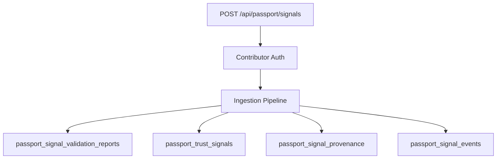
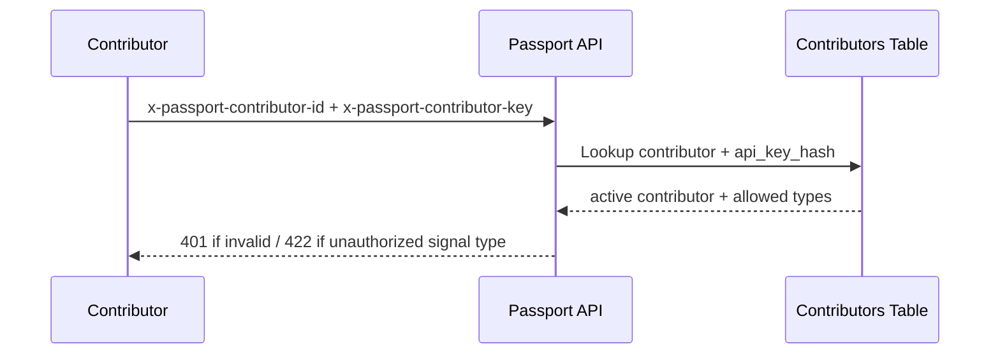

# Passport Trust Signal — Server Implementation

**Version:** Platform v2.1 (Phase 2)  
**Status:** Beta — server-side ingestion operational  
**Contracts:** Platform v2.0 frozen — implementation conforms, does not modify

---

## Overview

Phase 2 implements the first production server infrastructure for Trust Signals:

- Supabase/Postgres persistence
- Contributor API key authorization
- 9-stage ingestion pipeline
- Structured validation and consent gate
- Idempotency and duplicate detection
- Internal event bus (DB-backed, swappable)
- Internal REST API

**Not implemented:** Trust Engine, scoring, AI, reputation algorithms, external API.

---

## Persistence flow



---

## Database schema

| Table | Purpose |
|-------|---------|
| `passport_signal_contributors` | Contributor registry + API key hash |
| `passport_consent_grants` | Server-side consent references |
| `passport_trust_signals` | Normalized signal records |
| `passport_signal_validation_reports` | Structured validation results |
| `passport_signal_provenance` | Provenance metadata |
| `passport_signal_events` | Internal event log |

Migration: `migrations/0056_passport_trust_signals.sql`

All tables have RLS enabled with **no permissive policies** — server uses `DATABASE_URL` (table owner bypasses RLS).

---

## Authorization flow



### Headers

| Header | Purpose |
|--------|---------|
| `x-passport-contributor-id` | Contributor identifier (e.g. `bamsignal`) |
| `x-passport-contributor-key` | API key |

### Environment

```bash
PASSPORT_SIGNAL_CONTRIBUTOR_BAMSIGNAL_KEY=your-dev-key
```

On startup, if set, the key hash is written to `passport_signal_contributors`.

---

## API lifecycle

### POST `/api/passport/signals`

Ingest a trust signal.

**Request body:**

```json
{
  "passportId": "SKL-4A7D-9XQ2",
  "signalType": "positive_interaction",
  "category": "community",
  "occurredAt": "2026-07-22T08:00:00.000Z",
  "consentRef": "contributor:bamsignal:signal_emission",
  "explanation": "Positive community interaction",
  "evidence": {
    "evidenceRef": "bamsignal:interaction:abc",
    "storageProduct": "bamsignal",
    "retrievable": true
  },
  "idempotencyKey": "unique-key-1",
  "contributorEventId": "evt-1",
  "correlationId": "corr-1"
}
```

**Responses:**

| Status | Meaning |
|--------|---------|
| `201` | Signal created |
| `200` | Duplicate idempotency key — existing signal returned |
| `401` | Contributor auth failed |
| `422` | Validation or consent gate failed |
| `429` | Rate limited |
| `503` | Database unavailable |

### GET `/api/passport/signals/:id`

Retrieve signal by `signal_id`.

### GET `/api/passport/passports/:passportId/signals`

List signals for a Passport ID (newest first).

---

## Ingestion pipeline (implemented)

| Stage | Implementation |
|-------|----------------|
| Receive | Auth + idempotency metadata |
| Validate | `validation.js` — 8 validators |
| Consent Check | `consentGate.js` + `passport_consent_grants` |
| Normalize | `persistence.js` — canonical shape |
| Audit Reference | Generated `audit:passport_signal:...` ref |
| Deduplicate | Unique `(contributor_id, idempotency_key)` |
| Persist | Signals + validation + provenance |
| Publish Event | `eventBus.js` → `passport_signal_events` |
| Future Trust Engine | Marker stage — not implemented |

Service: `server/services/passportSignals/ingestion.js`

---

## Migration strategy

1. Deploy migration `0056_passport_trust_signals.sql` via `npm run migrate` or Coolify auto-migrate
2. Set `PASSPORT_SIGNAL_CONTRIBUTOR_BAMSIGNAL_KEY` in runtime env
3. Verify tables in `/ready?details=1` schema check
4. Seed contributors applied by migration (bamsignal, bayright, yike)

---

## Operational considerations

- **Rate limit:** 120 ingest requests/minute per contributor
- **Observability:** `passport_signal_ingested`, `passport_signal_ingestion_failed` events
- **Metrics:** `getPassportSignalMetrics()` — in-process counters
- **Evidence:** Only metadata stored — raw payloads remain in products
- **Signature validation:** Stub accepts all (cryptographic signing deferred)

---

## Code map

| Concern | Path |
|---------|------|
| API routes | `api/passport/signals.js` |
| Ingestion | `server/services/passportSignals/ingestion.js` |
| Validation | `server/services/passportSignals/validation.js` |
| Auth | `server/services/passportSignals/contributorAuth.js` |
| Persistence | `server/services/passportSignals/persistence.js` |
| Events | `server/services/passportSignals/eventBus.js` |
| Tests | `scripts/test-passport-signals.mjs` |

---

## Related documents

- [TRUST_SIGNAL_STANDARD.md](./TRUST_SIGNAL_STANDARD.md)
- [SIGNAL_INGESTION.md](./SIGNAL_INGESTION.md)
- [VERSION_GOVERNANCE.md](./VERSION_GOVERNANCE.md)

---

## Remaining gaps (Phase 2.2+)

- Cryptographic signature validation
- Async queue adapter (Redis/Kafka) for event bus
- BayRight and Yike contributor key provisioning
- Consent Platform UI integration
- Trust Engine consumption of validated signals
- External Passport API
