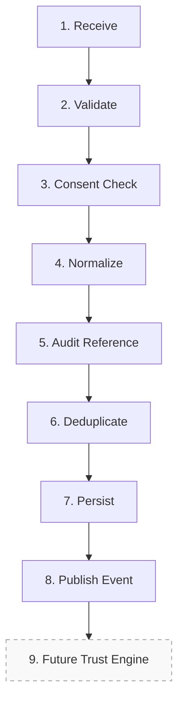
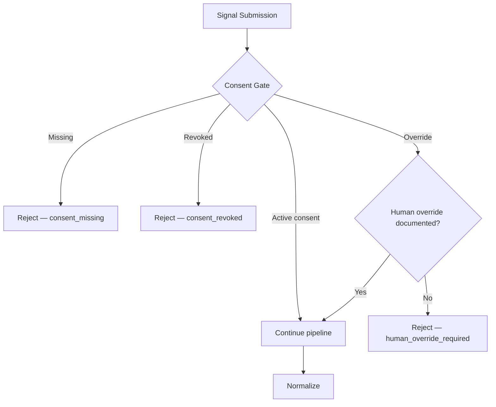
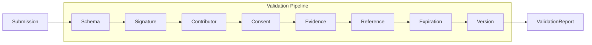
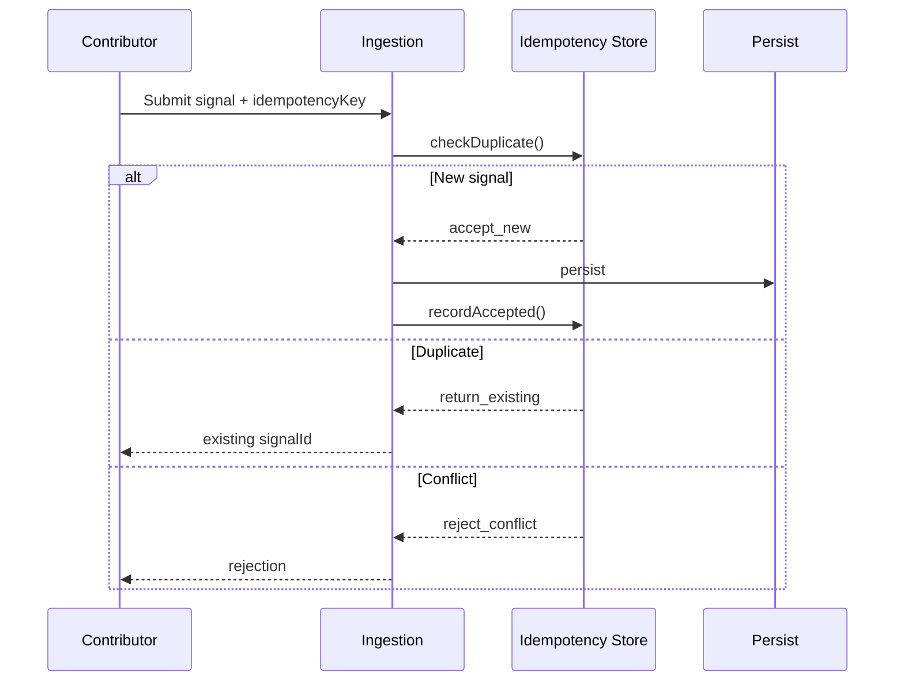
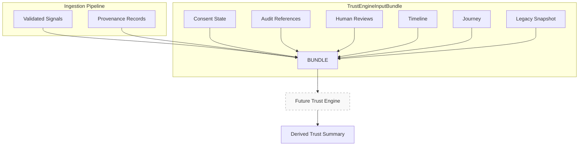

# Stankings Digital Trust Passport — Signal Ingestion

**Version:** Platform v2.0 (Phase 1)  
**Status:** Pipeline contracts — interfaces only  
**Foundation:** Frozen at v1.2

---

## Overview

Signal ingestion is the production pipeline through which Trust Contributors emit evidence into the Passport platform. This sprint defines **contracts only** — no database, queues, API routes, or workers.

Implementation: `src/passport/ingestion/`

---

## Pipeline stages



| Stage | Order | Description |
|-------|-------|-------------|
| **Receive** | 1 | Accept submission from authenticated contributor |
| **Validate** | 2 | Schema, signature, contributor, evidence, reference, expiration, version |
| **Consent Check** | 3 | Verify active consent — no signal without consent |
| **Normalize** | 4 | Map to canonical `TrustSignal` — never store raw payloads |
| **Audit Reference** | 5 | Append audit timeline reference |
| **Deduplicate** | 6 | Idempotency key and replay detection |
| **Persist** | 7 | Store normalized signal reference |
| **Publish Event** | 8 | Emit `signal_created` or related event |
| **Future Trust Engine** | 9 | Validated signals available for derivation |

Implementation: `SIGNAL_INGESTION_PIPELINE` in `src/passport/ingestion/pipeline.ts`

---

## Consent flow



Requirements: `SIGNAL_CONSENT_GATE_REQUIREMENTS` in `src/passport/signals/consentGate.ts`

---

## Validation flow



Each validator returns `SignalValidationResult`. Composite `SignalValidationReport` determines pipeline continuation.

---

## Idempotency and deduplication



Metadata: `SignalIdempotencyMetadata` — `idempotencyKey`, `contributorEventId`, `correlationId`

---

## Ingestion context

```typescript
// Contract shape — see src/passport/ingestion/pipeline.ts
type SignalIngestionContext = {
  submission: TrustSignalSubmission;
  idempotency: SignalIdempotencyMetadata;
  receivedAt: string;
  correlationId: string;
};
```

Result: `SignalIngestionResult` — success with `ValidatedTrustSignal` or failure with `failedStage`.

---

## Future Trust Engine flow



**Never:** raw contributor payloads, direct database records, unvalidated signals.

Contract: `TrustEngineInputBundle` in `src/passport/evolution/trustEngineContract.ts`

---

## Event publishing

After successful persist, ingestion publishes events:

| Event | When |
|-------|------|
| `signal_created` | New validated signal |
| `signal_updated` | Signal metadata updated |
| `signal_revoked` | Signal withdrawn |
| `human_review_requested` | Review required |
| `trust_recomputed` | Future — after engine derivation |

Interfaces: `PassportSignalEventPublisher`, `PassportSignalEventSubscriber`

---

## What is NOT in this phase

| Excluded | Reason |
|----------|--------|
| Database tables | Implementation Phase A.2 |
| Supabase migrations | Implementation |
| API routes | Implementation |
| Cron / workers | Implementation |
| Redis / Kafka | Implementation |
| Trust calculations | Trust Engine Phase B |
| AI / ML | Prohibited by constitution |

---

## Code map

| Concern | Module |
|---------|--------|
| Pipeline stages | `src/passport/ingestion/pipeline.ts` |
| Public exports | `src/passport/ingestion/index.ts` |
| Validation | `src/passport/signals/validation.ts` |
| Consent gate | `src/passport/signals/consentGate.ts` |
| Idempotency | `src/passport/signals/idempotency.ts` |
| Events | `src/passport/signals/events.ts` |

---

## Maturity

| Capability | Maturity |
|------------|----------|
| Signal Ingestion | Beta (server implemented) |

Implementation guide: [SIGNAL_IMPLEMENTATION.md](./SIGNAL_IMPLEMENTATION.md)

---

## Related documents

- [TRUST_SIGNAL_STANDARD.md](./TRUST_SIGNAL_STANDARD.md)
- [VERSION_GOVERNANCE.md](./VERSION_GOVERNANCE.md)
- [DIGITAL_TRUST_CONSTITUTION.md](./DIGITAL_TRUST_CONSTITUTION.md)

---

## Future implementation roadmap

1. **Platform v2.1** — Contributor authentication, signal persistence
2. **Platform v2.2** — Async ingestion queue, event bus
3. **Trust Engine v1.0** — Derivation from validated signals
4. **Passport API v1.0** — External scoped summaries
