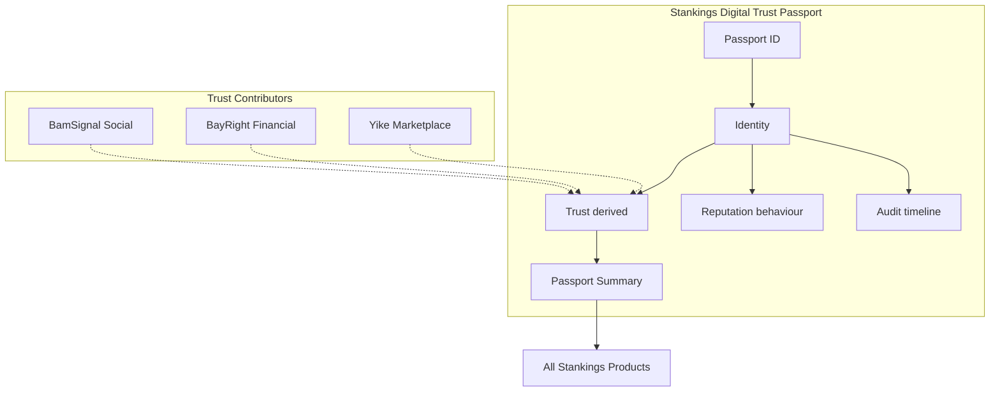

# Stankings Digital Trust Passport

**Status:** Foundational platform architecture (BamSignal first consumer)  
**Scope:** Digital Trust layer — no scoring, no backend/API/Supabase redesign  
**Constitution:** [DIGITAL_TRUST_CONSTITUTION.md](./DIGITAL_TRUST_CONSTITUTION.md) — **governing document**

---

## Mission

The Passport is a **transparent trust framework** — not a score that judges people.

Every person owns exactly one Stankings Digital Trust Passport. Products contribute trust signals; the Passport derives multi-dimensional, explainable confidence.

- Passport ID is **immutable**
- Products **never create identities** — they consume Passport
- Products **never own trust** — they **contribute** trust signals
- BamSignal is the **first Trust Contributor** (Social Trust)

---

## Layer model

```
Human
  ↓
Passport
  ↓
Identity     — Who is this person?
  ↓
Trust        — How confident are we? (derived)
  ↓
Workspace    — Where are they operating?
  ↓
Persona      — How do they appear?
  ↓
Permissions  — Client capability gates
  ↓
Product Profiles & Activities (product-owned)
```

Four independent concepts:

| Concept | Represents |
|---------|------------|
| **Identity** | The human |
| **Trust** | Derived confidence |
| **Reputation** | Behaviour history |
| **Audit** | Event timeline |

See [DIGITAL_TRUST_MODEL.md](./DIGITAL_TRUST_MODEL.md) for full trust architecture.

---

## Passport ID

**Product:** Stankings Digital Trust Passport  
**Credential type:** Passport ID  
**Format:** `SKL-XXXX-XXXX` (example: `SKL-4A7D-9XQ2`)

- `SKL` = **Stankings Legacy** (individual Passport namespace)
- Cryptographically secure random assignment
- Immutable once bound to an identity anchor
- Provisional dev `STP-*` IDs auto-upgrade to `SKL-*` on next bind

See [PASSPORT_IDENTIFIER_STANDARD.md](./PASSPORT_IDENTIFIER_STANDARD.md) for the full specification.

---

## Trust Contributors

Products register in `TRUST_CONTRIBUTOR_REGISTRY` — no hardcoded product logic.

| Product | Contributes | Shipped |
|---------|-------------|---------|
| BamSignal | Social Trust, Identity Trust | ✓ |
| BayRight | Financial Trust | Reserved |
| Yike | Marketplace Trust | Reserved |
| Stankings | Ecosystem Trust | Reserved |

Future: Education, Healthcare, Employment, Travel, Government.

---

## Passport Summary

Canonical portable trust object — **no raw product data**:

```typescript
import { buildPassportSummary } from "src/passport";

const summary = buildPassportSummary();
// identity + trust dimensions + products + timeline
```

Standard consumption pattern for all Stankings products.

---

## Privacy model

Passport stores: identity, trust summaries, audit references, product participation.

Products own: chats, wallets, listings, transactions, messages, preferences, financial records, marketplace data.

Implementation: `src/passport/privacy.ts`

---

## External API (prepared)

Abstraction interfaces for future scoped trust summaries — not implemented HTTP.

- Consent-based scopes (`identity.summary`, `trust.summary`, …)
- `filterSummaryByScopes()` enforces privacy at API boundary
- `localPassportApiClient` for development

See `src/passport/externalApi.ts`

---

## Code map

| Module | Path |
|--------|------|
| Public API | `src/passport/index.ts` |
| Passport ID | `src/passport/id.ts` |
| Identity + session | `src/passport/session.ts` |
| Trust dimensions | `src/passport/trust/` |
| Trust contributors | `src/passport/trust/contributors/registry.ts` |
| Behaviour reputation | `src/passport/reputation/` |
| Passport Summary | `src/passport/summary.ts` |
| External API interfaces | `src/passport/externalApi.ts` |
| Privacy | `src/passport/privacy.ts` |
| **Governance** | `src/passport/governance/` |
| **Maturity registry** | `src/passport/governance/maturity.ts` |
| Audit timeline | `src/passport/audit.ts` |
| Workspaces | `src/workspaces/` |
| Personas | `src/passport/personas/` |
| Identity UI | `src/components/identity/PassportIdentityPanel.tsx` |

---

## Storage keys (client)

| Key | Purpose |
|-----|---------|
| `stankings-passport-id-registry-v1` | Immutable anchor → Passport ID |
| `stankings-passport-session-v1` | Workspace, persona, route |
| `stankings-passport-identity-v1` | Identity snapshot |
| `stankings-passport-audit-v1` | Audit timeline |

Legacy workspace keys migrate once automatically.

---

## Ecosystem integration roadmap

1. **BamSignal (now)** — first consumer; contributes Social Trust; binds Passport on auth
2. **BayRight** — register contributor; emit financial signals; consume Passport Summary
3. **Yike** — register contributor; emit marketplace signals
4. **Passport platform service** — server-side trust derivation, cross-device sync, external API
5. **Trust engine** — derives dimension confidence from contributor signals (not in BamSignal repo)

No authentication rewrite required for any step.

---

## Future scoring strategy

**This sprint: interfaces only.**

1. Contributors register signal types (`preparedSignals`)
2. Products emit signals to Passport service (future)
3. Trust engine derives `TrustConfidenceLevel` per dimension
4. Passport Summary exposes high-level trust
5. External consumers receive scoped summaries with consent

Trust is **always derived**. Never manually assigned in product code.

---

## Architecture diagram



---

## Migration & compatibility

1. Existing Passport IDs remain stable (same anchor → same ID)
2. Existing users gain `identityConfidence` on next bind
3. Legacy reputation API preserved via `getLegacyReputationSnapshot()`
4. Auth, Supabase, APIs unchanged

---

## Related documentation

- **[PASSPORT_IDENTIFIER_STANDARD.md](./PASSPORT_IDENTIFIER_STANDARD.md)** — SKL-XXXX-XXXX format, prefixes, validation
- **[DIGITAL_TRUST_CONSTITUTION.md](./DIGITAL_TRUST_CONSTITUTION.md)** — governing principles, ethics, consent, disputes, AI policy
- [DIGITAL_TRUST_MODEL.md](./DIGITAL_TRUST_MODEL.md) — trust, reputation, audit, contributors, privacy, external API
- [IDENTITY_ARCHITECTURE.md](./IDENTITY_ARCHITECTURE.md) — workspace, persona, permissions
