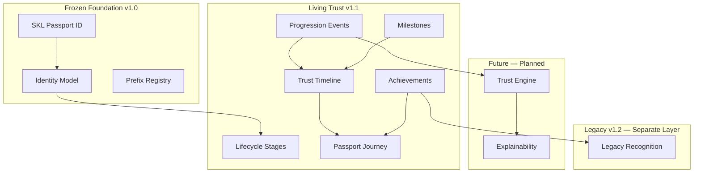

# Stankings Digital Trust Passport — Trust Evolution Model

**Version:** 1.2  
**Status:** Evolution architecture — extends Foundation v1.0; Legacy layer documented separately in v1.2  
**Foundation:** Frozen contracts in [DIGITAL_TRUST_CONSTITUTION.md](./DIGITAL_TRUST_CONSTITUTION.md)  
**Legacy:** [LEGACY_ARCHITECTURE.md](./LEGACY_ARCHITECTURE.md) — distinct from lifecycle and timeline

---

## Growth philosophy

The Stankings Digital Trust Passport is a **Living Digital Trust Passport**.

| Permanent | Dynamic |
|-----------|---------|
| Identity (`SKL-XXXX-XXXX`) | Trust dimensions |
| Passport ID | Reputation |
| Constitutional principles | Confidence |
| Namespace registry | Lifecycle stage |

> Identity is permanent. Trust is dynamic. Reputation evolves. Confidence grows.

Every Passport should tell the story of a person's **growth** — not just their current state.

Implementation philosophy: `LIVING_PASSPORT_PHILOSOPHY` in `src/passport/evolution/evolutionModel.ts`

---

## Principle 11 — Trust Can Be Earned

The Passport must **never permanently define a person by isolated mistakes**.

Trust evolves through:

- Verified identity
- Positive participation
- Responsible behaviour
- Completed transactions
- Successful interactions
- Dispute resolution
- Long-term consistency

Historical events remain **auditable**. Trust summaries remain **current**.

No algorithms in this sprint — constitutional principle only.

---

## Dynamic trust philosophy

```text
Trust summaries remain current.
Historical events remain auditable.
The Passport must never permanently define a person by isolated mistakes.
```

Implementation: `DYNAMIC_TRUST_PHILOSOPHY` in `src/passport/evolution/evolutionModel.ts`

---

## Trust lifecycle

Lifecycle stages communicate **maturity** — they are **not rankings** and **never replace trust dimensions**.

```text
Anonymous
  ↓
Registered
  ↓
Verified
  ↓
Trusted
  ↓
Established
  ↓
Distinguished
```

| Stage | Meaning |
|-------|---------|
| Anonymous | Passport not yet bound |
| Registered | Passport created and bound |
| Verified | Core verification milestones |
| Trusted | Positive participation in trust dimensions |
| Established | Sustained cross-product consistency |
| Distinguished | Notable ecosystem contribution |

> **Legacy is not a lifecycle stage.** Legacy is a separate layer that emerges over decades. See [LEGACY_ARCHITECTURE.md](./LEGACY_ARCHITECTURE.md).

Implementation: `PASSPORT_LIFECYCLE_STAGES` in `src/passport/evolution/lifecycle.ts`

---

## Passport evolution model

Long-term evolution path:

```text
Identity
  ↓
Verification
  ↓
Participation
  ↓
Contribution
  ↓
Consistency
  ↓
Confidence
```

> Legacy is the **final layer** above Achievements — see [LEGACY_ARCHITECTURE.md](./LEGACY_ARCHITECTURE.md).

Implementation: `PASSPORT_EVOLUTION_PHASES` in `src/passport/evolution/evolutionModel.ts`



---

## Trust progression

Extension interfaces for future trust growth events.

| Event kind | Description |
|------------|-------------|
| `identity_verified` | Core identity verification |
| `phone_verified` | Phone verification |
| `government_id_verified` | Authorized government attestation |
| `marketplace_participation` | Marketplace domain participation |
| `financial_participation` | Financial domain participation |
| `community_participation` | Social community participation |
| `long_term_activity` | Sustained ecosystem activity |
| `positive_dispute_resolution` | Fair dispute outcome |
| `years_of_good_standing` | Multi-year consistency |
| `ecosystem_contribution` | Notable ecosystem contribution |

No calculations — registry and interfaces only.

Implementation: `TRUST_PROGRESSION_EVENT_REGISTRY` in `src/passport/evolution/progression.ts`

---

## Trust Timeline vs Audit

| Concept | Question | Content |
|---------|----------|---------|
| **Audit** | What happened? | Complete event history |
| **Trust Timeline** | How did the Passport evolve? | Curated positive milestones |

Example timeline:

```text
2026 — Passport Created
  ↓
Identity Verified
  ↓
BamSignal Joined
  ↓
100 Positive Community Interactions
  ↓
BayRight Linked
  ↓
Financial Verification Completed
  ↓
Five Years Good Standing
```

Implementation: `src/passport/evolution/timeline.ts`

---

## Passport Journey

The user's narrative across the Stankings ecosystem.

| Section | Content |
|---------|---------|
| Identity | Immutable Passport ID |
| Verification | Verification milestones |
| Trust | Multi-dimensional evolution |
| Products Joined | Connected Trust Contributors |
| Achievements | Positive badges |
| Milestones | Participation markers |
| Years Active | Duration of participation |
| Future Contributions | Reserved dimensions/products |

Implementation: `PASSPORT_JOURNEY_SECTIONS` in `src/passport/evolution/journey.ts`

---

## Achievements

Achievements **do not affect trust directly**. They communicate positive milestones.

| Achievement | Label |
|-------------|-------|
| `verified_identity` | Verified Identity |
| `early_member` | Early Member |
| `founding_member` | Founding Member |
| `trusted_marketplace_seller` | Trusted Marketplace Seller |
| `financial_integrity` | Financial Integrity |
| `community_builder` | Community Builder |
| `five_years_active` | Five Years Active |
| `ten_years_active` | Ten Years Active |
| `legacy_member` | Legacy Member |

Implementation: `PASSPORT_ACHIEVEMENT_REGISTRY` in `src/passport/evolution/achievements.ts`

---

## Milestones

Participation markers — registry only.

| Milestone | Label |
|-----------|-------|
| `first_verification` | First Verification |
| `first_trust_contributor` | First Trust Contributor |
| `first_marketplace_transaction` | First Marketplace Transaction |
| `first_escrow_completion` | First Escrow Completion |
| `transactions_100` | 100 Successful Transactions |
| `community_actions_1000` | 1000 Positive Community Actions |
| `five_years_active` | Five Years Active |
| `ten_years_active` | Ten Years Active |
| `legacy_status` | Legacy Status |

Implementation: `PASSPORT_MILESTONE_REGISTRY` in `src/passport/evolution/milestones.ts`

---

## Future Trust Engine contract

The future Trust Engine may **consume** — never expose algorithms in client code.

| Input category | Source |
|----------------|--------|
| Trust signals | Contributor products |
| Verification events | Progression registry |
| Audit references | Audit timeline (references only) |
| Reputation dimensions | Behaviour reputation layer |
| Product participation | Passport Summary |
| Dispute outcomes | Dispute architecture (human review) |
| Consent state | Consent architecture |
| Human reviews | Mandatory for high-impact derivations |

Interface: `TrustEngineInputBundle` in `src/passport/evolution/trustEngineContract.ts`

**Not implemented.** No scoring. No ML. No autonomous decisions.

---

## Explainability update (Principle 11)

Future responses must answer — in **human-readable** language:

- Why is this Passport trusted?
- How has trust improved?
- What milestones contributed?
- Which products participated?
- What remains incomplete?

Types: `PassportTrustEvolutionExplanation`, `buildPlaceholderTrustEvolutionExplanation()`

Implementation: `src/passport/governance/explainability.ts`

---

## User visibility (future dashboard)

Architecture contract for future Passport dashboard sections:

- Identity
- Trust
- Reputation
- Achievements
- Journey
- Timeline
- Connected Products
- Consent
- Disputes
- Milestones
- Legacy
- Legacy Contributions
- Legacy Timeline
- Legacy Badges
- Recommendations

No UI in this sprint — `buildUserPassportVisibilitySnapshot()` extended.

Implementation: `src/passport/governance/userVisibility.ts`

---

## Future Passport types (linkable)

Reserved namespaces may eventually link across a human's ecosystem participation:

```text
Individual Passport (SKL)
  ↓ may link
Business Passport (SKB)
  ↓ may link
Organization Passport (SKO)
  ↓ may link
Government Passport (SKG)
  ↓ may link
Autonomous Agent Passport (SKA)
```

Documented only — see [PASSPORT_IDENTIFIER_STANDARD.md](./PASSPORT_IDENTIFIER_STANDARD.md).

---

## AI governance update

Artificial Intelligence may **assist** in identifying patterns.

AI must **never** become the final authority for:

- Identity
- Verification
- Permanent trust
- Disputes
- High-impact decisions

- Disputes
- High-impact decisions
- Legacy recognition

Human oversight remains **mandatory**.

Implementation: `AI_USAGE_POLICY` in `src/passport/governance/index.ts`

---

## Legacy vs Evolution

| Evolution (v1.1) | Legacy (v1.2) |
|------------------|---------------|
| Lifecycle stages | Legacy recognition status |
| Trust Timeline | Legacy Timeline |
| Achievements | Legacy Badges |
| Milestones | Legacy Contributions |
| Months to years | Decades |

Full Legacy architecture: [LEGACY_ARCHITECTURE.md](./LEGACY_ARCHITECTURE.md)

---

## SKL namespace

**SKL = Stankings Legacy** — the individual Passport namespace encodes the long-term vision:

A lifelong digital trust journey where participation, consistency, and positive contribution build explainable confidence over decades — with Legacy as the final layer of stewardship recognition.

See [LEGACY_ARCHITECTURE.md](./LEGACY_ARCHITECTURE.md) for the complete Legacy model.

---

## Code map

| Concern | Module |
|---------|--------|
| Lifecycle stages | `src/passport/evolution/lifecycle.ts` |
| Progression events | `src/passport/evolution/progression.ts` |
| Trust Timeline | `src/passport/evolution/timeline.ts` |
| Passport Journey | `src/passport/evolution/journey.ts` |
| Achievements | `src/passport/evolution/achievements.ts` |
| Milestones | `src/passport/evolution/milestones.ts` |
| Evolution philosophy | `src/passport/evolution/evolutionModel.ts` |
| Trust Engine contract | `src/passport/evolution/trustEngineContract.ts` |
| Public exports | `src/passport/evolution/index.ts` |

---

## Maturity (v1.1 capabilities)

| Capability | Maturity |
|------------|----------|
| Trust Lifecycle | Foundation |
| Trust Progression | Foundation |
| Trust Timeline | Foundation |
| Passport Journey | Foundation |
| Achievements | Foundation |
| Milestones | Foundation |
| Trust Evolution Model | Foundation |
| Trust Engine | Planned |
| Legacy | Foundation |
| Legacy Contributions | Foundation |
| Legacy Timeline | Foundation |
| Legacy Recognition | Foundation |
| Legacy API | Planned |

See `PASSPORT_CAPABILITY_REGISTRY` in `src/passport/governance/maturity.ts`

---

## Related documents

- [DIGITAL_TRUST_CONSTITUTION.md](./DIGITAL_TRUST_CONSTITUTION.md)
- [LEGACY_ARCHITECTURE.md](./LEGACY_ARCHITECTURE.md)
- [STANKINGS_PASSPORT.md](./STANKINGS_PASSPORT.md)
- [PASSPORT_IDENTIFIER_STANDARD.md](./PASSPORT_IDENTIFIER_STANDARD.md)
- [DIGITAL_TRUST_MODEL.md](./DIGITAL_TRUST_MODEL.md)

---

## Amendment note

This document **extends** Foundation v1.0. It does **not** modify:

- `SKL-XXXX-XXXX` Passport ID format
- Identity, Workspace, Persona, Permission models
- Trust Contributor registry
- Passport Summary schema
- Constitutional principles 1–10

Constitution version **1.1.0** added Principle 11 and evolution architecture.  
Constitution version **1.2.0** added Principle 12 and Legacy layer (see [LEGACY_ARCHITECTURE.md](./LEGACY_ARCHITECTURE.md)).
