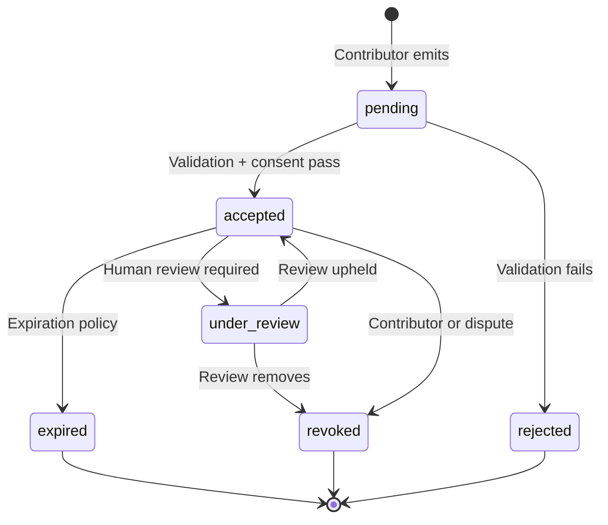
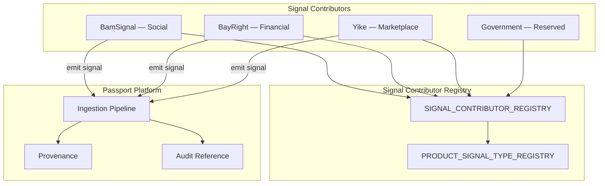
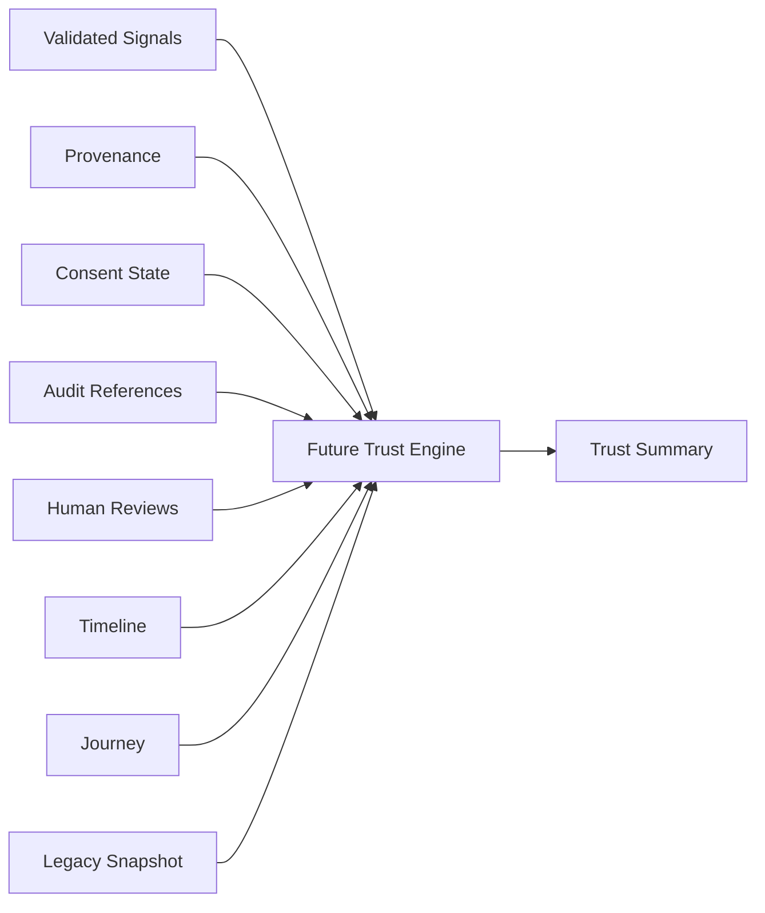

# Stankings Digital Trust Passport — Trust Signal Standard

**Version:** Platform v2.0 (Phase 1)  
**Status:** Canonical evidence layer — interfaces only  
**Foundation:** Frozen at v1.2 — extends, never modifies

---

## Philosophy

> **Signals are evidence. Signals are NOT trust.**

Trust Signals are the canonical evidence layer that future ecosystem products emit. The Passport indexes references and metadata — never raw product payloads.

| Signals are | Signals are not |
|-------------|-----------------|
| Evidence from contributors | Trust scores |
| Explainable and auditable | Reputation algorithms |
| Consent-gated | Autonomous judgments |
| Expirable and revocable | Permanent labels |

Implementation: `src/passport/signals/`

---

## Signal lifecycle

---

## Evidence categories

| Category | Domain |
|----------|--------|
| Identity | Identity binding evidence |
| Verification | Verification milestones |
| Financial | Financial integrity evidence |
| Marketplace | Transaction and merchant evidence |
| Community | Social participation evidence |
| Professional | Employment evidence |
| Education | Credential evidence |
| Government | Authorized attestation |
| Security | Security events |
| Compliance | Policy events |
| Legacy | Long-horizon contribution evidence |

Implementation: `TRUST_SIGNAL_EVIDENCE_CATEGORIES` in `src/passport/signals/categories.ts`

---

## Canonical Trust Signal

Every signal supports:

| Field | Purpose |
|-------|---------|
| `signalId` | Unique signal identifier |
| `contributorId` | Emitting contributor |
| `category` | Evidence category |
| `signalType` | Registered type (e.g. `successful_match`) |
| `occurredAt` | When the event happened |
| `recordedAt` | When Passport recorded it |
| `consentRef` | Consent basis reference |
| `auditRef` | Audit timeline reference |
| `confidence` | Evidence quality metadata — **not person score** |
| `evidence` | Opaque evidence reference in originating product |
| `sourceProduct` | Product that owns the evidence |
| `version` | Signal schema version |
| `humanReviewRequirement` | none / recommended / required / completed |
| `status` | pending / accepted / under_review / revoked / expired / rejected |
| `explanation` | Human-readable why |
| `expiration` | Expiration policy |
| `revocation` | Revocation record if withdrawn |

Type: `TrustSignal` in `src/passport/signals/types.ts`

Validated output: `ValidatedTrustSignal` — passed ingestion pipeline.

---

## Contributor flow

---

## Product signal registrations

### BamSignal (Social)

| Signal Type | Category |
|-------------|----------|
| `profile_verified` | Verification |
| `identity_verified` | Identity |
| `positive_interaction` | Community |
| `successful_match` | Community |
| `community_participation` | Community |
| `policy_violation` | Compliance |
| `appeal_approved` | Compliance |

### BayRight (Financial)

| Signal Type | Category |
|-------------|----------|
| `bank_verified` | Financial |
| `successful_escrow` | Financial |
| `completed_settlement` | Financial |
| `chargeback` | Financial |
| `refund` | Financial |
| `fraud_investigation` | Security |

### Yike (Marketplace)

| Signal Type | Category |
|-------------|----------|
| `verified_seller` | Marketplace |
| `verified_buyer` | Marketplace |
| `successful_transaction` | Marketplace |
| `inspection_passed` | Marketplace |
| `property_verified` | Verification |
| `dispute_closed` | Compliance |

Implementation: `PRODUCT_SIGNAL_TYPE_REGISTRY`, `SIGNAL_CONTRIBUTOR_REGISTRY` in `src/passport/signals/contributors.ts`

---

## Signal contributors

| Contributor | Trust Domain | Status |
|-------------|--------------|--------|
| BamSignal | Social | Active |
| BayRight | Financial | Reserved |
| Yike | Marketplace | Reserved |
| Stankings | Ecosystem | Reserved |
| Government | Government | Reserved |
| Financial Institution | Institutional | Reserved |
| Employer | Employment | Reserved |
| Educational Institution | Education | Reserved |
| User Verified | Social | Reserved |
| Manual Review | Manual | Reserved |

Each contributor defines: capabilities, allowed signal types, verification level, documentation.

---

## Provenance

Every signal must answer:

| Question | Field |
|----------|-------|
| Who emitted it? | `contributorId` |
| When? | `occurredAt`, `recordedAt` |
| Why? | `explanation` |
| Under what consent? | `consentRef` |
| Can it be verified? | `evidence.retrievable` |
| Has it been revoked? | `revocation` |
| Is it authoritative? | contributor verification + status |

Implementation: `src/passport/signals/provenance.ts`

---

## Idempotency

Every submission carries:

- `idempotencyKey` — exactly-once semantics
- `contributorEventId` — contributor correlation
- `correlationId` — cross-system tracing
- Replay detection and duplicate handling contracts

Implementation: `src/passport/signals/idempotency.ts`

---

## Validation

Eight validation kinds (interfaces only):

1. Schema
2. Signature
3. Contributor
4. Consent
5. Evidence
6. Reference
7. Expiration
8. Version

Implementation: `src/passport/signals/validation.ts`

---

## Consent gate

No signal accepted unless:

- Consent exists
- Consent is active
- Consent is applicable to signal type
- Consent has not been revoked
- Human override is documented when bypassed

Implementation: `src/passport/signals/consentGate.ts`

---

## Event model

Future events (contracts only):

- `signal_created`
- `signal_updated`
- `signal_revoked`
- `signal_expired`
- `consent_revoked`
- `contributor_suspended`
- `human_review_requested`
- `human_review_completed`
- `trust_recomputed`

Implementation: `src/passport/signals/events.ts`

---

## Trust Engine relationship

Validated signals feed the future Trust Engine — never raw payloads.

Extended contract: `TrustEngineInputBundle` in `src/passport/evolution/trustEngineContract.ts`

---

## Code map

| Concern | Module |
|---------|--------|
| Signal types | `src/passport/signals/types.ts` |
| Categories | `src/passport/signals/categories.ts` |
| Contributors | `src/passport/signals/contributors.ts` |
| Validation | `src/passport/signals/validation.ts` |
| Provenance | `src/passport/signals/provenance.ts` |
| Idempotency | `src/passport/signals/idempotency.ts` |
| Consent gate | `src/passport/signals/consentGate.ts` |
| Events | `src/passport/signals/events.ts` |
| Public exports | `src/passport/signals/index.ts` |

---

## Maturity

| Capability | Maturity |
|------------|----------|
| Trust Signals | Foundation |
| Signal Registry | Foundation |
| Signal Contributor Registry | Foundation |
| Signal Validation | Foundation |
| Signal Provenance | Foundation |
| Signal Ingestion | Beta (server implemented) |

See `PASSPORT_CAPABILITY_REGISTRY` in `src/passport/governance/maturity.ts`

Implementation: [SIGNAL_IMPLEMENTATION.md](./SIGNAL_IMPLEMENTATION.md)

---

## Related documents

- [SIGNAL_INGESTION.md](./SIGNAL_INGESTION.md)
- [VERSION_GOVERNANCE.md](./VERSION_GOVERNANCE.md)
- [adr/README.md](./adr/README.md)
- [DIGITAL_TRUST_CONSTITUTION.md](./DIGITAL_TRUST_CONSTITUTION.md)

---

## Amendment note

This standard **extends** Foundation v1.2. It does **not** modify frozen contracts. Planned ADR-0005 will formalize acceptance.
