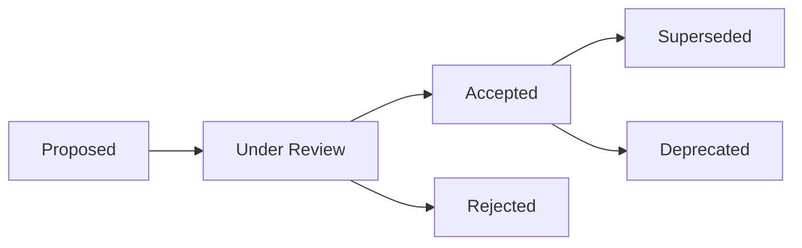

# Architecture Decision Records (ADR)

**Repository:** BamSignal / Stankings Digital Trust Passport  
**Status:** Active governance framework

---

## Purpose

Architecture Decision Records document **significant architectural decisions** for the Stankings Digital Trust Passport and ecosystem.

ADRs provide:

- A durable record of **why** decisions were made
- Traceability across BamSignal, BayRight, Yike, and future products
- A review path for changes to frozen platform contracts
- Onboarding context for engineers joining the platform

---

## Lifecycle

| Status | Meaning |
|--------|---------|
| **Proposed** | Draft under discussion — not yet authoritative |
| **Under Review** | Active architectural review in progress |
| **Accepted** | Decision is authoritative and binding |
| **Superseded** | Replaced by a newer ADR — read both for history |
| **Deprecated** | No longer recommended — may remain for reference |
| **Rejected** | Considered and explicitly not adopted |

---

## Template

Each ADR must include:

1. **Title** — short descriptive name
2. **Status** — lifecycle state
3. **Decision** — what was decided (one paragraph)
4. **Context** — background and constraints
5. **Problem** — what problem this solves
6. **Alternatives Considered** — options evaluated
7. **Decision Made** — the chosen approach
8. **Architectural Consequences** — positive and negative impacts
9. **Version Introduced** — Foundation v1.x, Platform v2.x, etc.
10. **Related Documents** — links to specs and code
11. **Future Considerations** — what may change later

Use filename format: `ADR-NNNN-short-title.md`

---

## Review process

1. **Propose** — author drafts ADR with status `Proposed`
2. **Review** — architecture review across affected Trust Contributors
3. **Accept or Reject** — update status; rejected ADRs remain for history
4. **Implement** — code and docs reference ADR number
5. **Supersede** — when decisions change, create new ADR; mark old as `Superseded`

Changes to **frozen Foundation contracts** require:

- New or superseding ADR
- Constitution version bump (when applicable)
- Backward compatibility assessment
- Cross-product review

---

## Numbering convention

| Range | Domain |
|-------|--------|
| ADR-0001–0099 | Foundation architecture (identity, trust, legacy) |
| ADR-0100–0199 | Trust Signals and ingestion |
| ADR-0200–0299 | Trust Engine |
| ADR-0300–0399 | Consent Platform |
| ADR-0400–0499 | Passport API and external integrations |
| ADR-0500+ | Product-specific extensions |

### Planned ADRs

| ADR | Title |
|-----|-------|
| ADR-0005 | Trust Signal Governance & Operations |
| ADR-0006 | Signal Contributor Framework |
| ADR-0007 | Trust Engine Inputs |
| ADR-0008 | Consent API |
| ADR-0009 | External Passport API |

---

## Index

| ADR | Title | Status | Version |
|-----|-------|--------|---------|
| [ADR-0001](./ADR-0001-foundation-v1.md) | Stankings Digital Trust Passport Foundation | Accepted | Foundation v1.0 |
| [ADR-0002](./ADR-0002-skl-passport-identifier.md) | SKL Passport Identifier | Accepted | Foundation v1.0 |
| [ADR-0003](./ADR-0003-trust-evolution.md) | Trust Evolution Architecture | Accepted | Foundation v1.1 |
| [ADR-0004](./ADR-0004-legacy-architecture.md) | Legacy Architecture | Accepted | Foundation v1.2 |
| [ADR-0005](./ADR-0005-trust-signal-governance.md) | Trust Signal Governance & Operations | Accepted | Platform v2.2 |

---

## Related documents

- [ADR_GUIDE.md](../ADR_GUIDE.md) — extended ADR guidance
- [VERSION_GOVERNANCE.md](../VERSION_GOVERNANCE.md) — architectural versioning
- [DIGITAL_TRUST_CONSTITUTION.md](../DIGITAL_TRUST_CONSTITUTION.md) — governing principles
