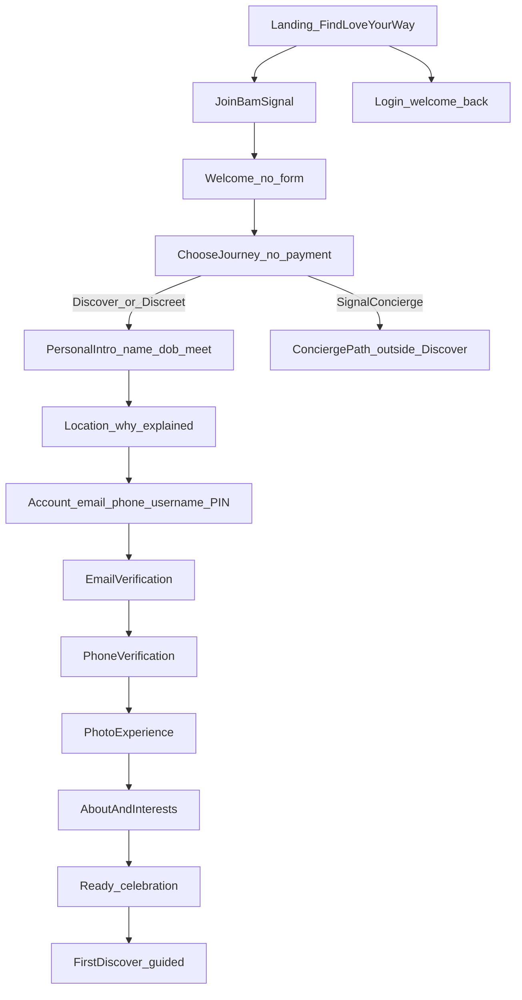

# Phase 4B — Relationship Journey Experience Architecture

**Status:** **Approved** (2026-07-19) — see [Experience Blueprint](./phase4b-experience-blueprint.md) for Journey Score, delight, meter, Guide, Golden Rule  
**Primary source of truth for implementation review:** [phase4b-experience-blueprint.md](./phase4b-experience-blueprint.md)  
**Related:** [Phase 4 audit](../audits/phase4-auth-onboarding/REPORT.md) · [Phase 3 membership](./phase3-membership-billing.md)

---

## Purpose

This document locks the emotional + information architecture. The **Experience Blueprint** expands it into screen order, decisions, transitions, motion, wireframes, a11y, and success metrics.

Every later screen (4C–4F) is judged against:

> How should this person feel right now?

Not:

> What information do we still need?

### Non-negotiable design principle

The user must never feel they are filling out forms. The journey is a guided relationship experience: one primary decision, one clear action, one emotional objective, one beautiful transition per screen. If a screen feels like paperwork, generic, or like another app — redesign it. Every screen must feel like BamSignal.

**Do not implement UI until the [Experience Blueprint](./phase4b-experience-blueprint.md) is approved.**

---

## Roadmap (locked)

| Status | Phase |
|--------|-------|
| Done | 1–2 Product architecture & positioning |
| Frozen | **3A** Membership foundation — no 3B until after 4F |
| Done | 4A Audit |
| **Now** | **4B Blueprint + architecture (docs only)** |
| Next | 4C → 4D → 4E → 4F |
| Later | **3B** Discreet checkout + invisibility |

---

## 1. Problem statement

### What works

The public homepage creates **curiosity, hope, and premium intent** (“Find Love Your Way.” + three distinct experiences).

### What breaks

The moment the user taps Join, that emotion collapses into a generic authentication wall:

- Dark box
- Six fields + checkbox + Continue
- No story continuity
- Almost zero trust reinforcement

The issue is not primarily visual polish. **The story breaks.**

### Wrong mental model (today)

```
Signup  →  Onboarding  →  Discover
```

Users feel they are filling paperwork, then completing a profile bureaucracy.

### Correct mental model (locked)

```
Relationship Journey
  → Identity
  → Verification
  → Profile
  → Discover
```

Users feel they are beginning a relationship journey on a trustworthy Nigerian-first platform.

---

## 2. Design philosophy

| Principle | Meaning |
|-----------|---------|
| Emotion before extraction | Ask “What should they feel?” before “What do we need?” |
| One idea per screen | Progressive disclosure — never a six-field wall |
| Account creation is late | Earn commitment after personal investment |
| Trust is woven | One calm signal per screen — not a badge dump |
| Experiences are independent | Discover / Discreet / Concierge are not upgrades of each other |
| Security without sabotage | Keep OTP, PIN, rate limits, bot protection; never hard-block Continue forever |
| One continuous story | Landing → Journey → Discover must feel like one product |

Benchmarks for **principles** (not visual clones): Apple, Airbnb, Revolut, Monzo, Nubank, Spotify, Notion, Linear, Duolingo.

Tone: intentional, calm, premium, emotional, trustworthy. Never flashy, noisy, or gimmicky.

---

## 3. Locked product constraints

These are non-negotiable production locks:

| Lock | Rule |
|------|------|
| Login | Username + PIN only — never email/password UI |
| Signup contact | Email + phone may be collected for verification |
| Copy | Forgot PIN / Reset PIN / Invalid username or PIN |
| Incomplete members | Route to `/onboarding` only |
| Completed members | Route to `/home` (Discover) |
| Onboarding surface | Onboarding UI only at `/onboarding` |
| Public Join | Must never trigger member session restore |
| Experiences | Discover, Discreet Membership, Signal Concierge™ — independent products |
| Concierge | Outside Discover ecosystem when Concierge-active |
| Payment | No payment on journey choice |
| Security | Email OTP, phone/WhatsApp OTP, PIN, CSRF, rate limits, bot protection preserved; soft-degrade if signup math unavailable |

---

## 4. Emotional arc

| Stage | User should feel | Must never feel |
|-------|------------------|-----------------|
| Landing | Curiosity + hope | Confused about what BamSignal is |
| Welcome | Excitement + belonging | “I hit a login wall” |
| Journey choice | Anticipation + agency | Upsold or pressured |
| Name / DOB / Meet | Seen / personal | Interrogated |
| Location | Clarity | Tracked without reason |
| Account | Safe commitment | Tricked into paperwork |
| Verification | Protected | Scared / punished |
| Photos | Pride | Embarrassed / judged harshly |
| About / Interests | Connection | Form fatigue |
| Ready | Confidence + celebration | Anticlimax |
| First Discover | Delight + guidance | Empty / lost |

Global emotional journey:

```
Landing → Curiosity → Hope → Excitement → Safety → Commitment
  → Progress → Delight → Confidence → Discovery
```

---

## 5. Canonical journey map



### Intent fork (locked)

| Choice | Next path |
|--------|-----------|
| **Discover** | Self-serve relationship journey → guided first Discover |
| **Discreet Membership** | Same self-serve journey; persist `experienceIntent=discreet`; no paywall here; privacy/membership later |
| **Signal Concierge™** | Divert to existing Concierge apply/consultation (`/signal-concierge`). **Never** Discover onboarding |

Pre-account steps live in a **local journey draft** until Account creation binds them to the member profile.

---

## 6. Progress model

Replace numeric “Step X of Y” (which can break, e.g. “Step 4 of 3”) with **named chapters**:

| Chapter | Screens |
|---------|---------|
| Welcome | Welcome |
| Intent | Choose journey |
| You | Name, DOB, who to meet, location |
| Secure | Account, email verify, phone verify |
| Profile | Photos, about, interests |
| Ready | Celebration → Discover |

Rules:

- Progress always reflects the active chapter path (Discover/Discreet vs Concierge diverge).
- Resume: merge local draft + server profile completeness; never restart from zero without confirmation.
- Back is always allowed within a chapter; leaving Secure after account creation uses server truth.

---

## 7. Trust system

### Trust bank (rotate — one subtle line max per screen)

Only claim what product can keep:

1. Verified members matter here  
2. Privacy comes first  
3. Your information is encrypted  
4. Built for meaningful relationships  
5. AI-assisted profile verification  
6. You’re in control of who you meet  

### Placement rules

- Never dump five badges on one screen.
- Prefer a single calm line under the CTA or in the shell footer.
- Legal acceptance stays on Account (required), not as the only “trust.”
- Login and reset screens also carry one trust line.

---

## 8. Journey Shell (shared frame)

All post-Join journey + auth screens share one **Journey Shell**:

- Same atmospheric language as landing (light photography / brand field — not a disconnected SaaS card)
- BamSignal wordmark / mark present
- Chapter progress
- One trust line
- Context-aware primary CTA
- Secondary: Back / Already have an account?
- Motion: calm page transitions; respect `prefers-reduced-motion`

This replaces the feeling of “leaving the homepage for another app.”

---

## 9. Screen-by-screen architecture

Copy below is **direction**, not final locked microcopy. Implementation may refine wording while preserving intent.

### Screen 0 — Landing (existing)

| Field | Spec |
|-------|------|
| Purpose | Create hope and present three ways to find love |
| Emotion | Curiosity + premium hope |
| Data | None |
| Trust | Safety / verification already present on page |
| CTA | Join BamSignal → Welcome (not a form wall) |
| Secondary | Login → Login welcome back |

---

### Screen 1 — Welcome

| Field | Spec |
|-------|------|
| Purpose | Enter BamSignal emotionally — no form |
| Emotion | Excitement, calm confidence |
| Data | None |
| Trust | “We’ll guide you — your privacy comes first.” |
| CTA | Continue / Begin |
| Back | Return to landing |
| Failure | N/A |
| Direction | “Welcome to BamSignal. Meaningful relationships begin with one step. We’ll guide you through everything.” |

---

### Screen 2 — Choose your journey

| Field | Spec |
|-------|------|
| Purpose | Capture relationship intent |
| Emotion | Agency, anticipation |
| Data | `experienceIntent`: `discover` \| `discreet` \| `concierge` |
| Trust | “No payment here — just how you want to meet.” |
| CTA | Continue (requires selection) |
| Back | Welcome |
| Failure | Soft prompt to choose one |
| Rules | No upsell, no prices, no “upgrade” language. Concierge selection exits to Concierge path. |

Cards (intent-aligned):

- Discover — Explore and connect yourself.  
- Discreet Membership — Date privately while staying invisible.  
- Signal Concierge™ — A dedicated matchmaker guides your journey.

---

### Screen 3 — Your name

| Field | Spec |
|-------|------|
| Purpose | Personal introduction |
| Emotion | Belonging |
| Data | Display / first name |
| Trust | “This is how people will know you.” |
| CTA | Continue |
| Input | One field, large touch target, autofill `given-name` |
| Failure | Gentle required validation |

Direction: “What should people call you?”

---

### Screen 4 — Date of birth

| Field | Spec |
|-------|------|
| Purpose | Age eligibility + later matching |
| Emotion | Dignity, calm |
| Data | DOB (derive age server-side) |
| Trust | “We use this to keep BamSignal adult and accurate.” |
| CTA | Continue |
| Input | Native-feeling date picker — elegant, not a 17–75 dropdown wall as the hero |
| Failure | Under-18 clear, non-blaming block with support path |

---

### Screen 5 — Who would you like to meet?

| Field | Spec |
|-------|------|
| Purpose | Relationship preference intent |
| Emotion | Hope, clarity |
| Data | Looking-for / gender preference (existing product enums) |
| Trust | One line: meaningful matches over volume |
| CTA | Continue |
| UI | Visual choices, minimal text — not a government form |

---

### Screen 6 — Location

| Field | Spec |
|-------|------|
| Purpose | Nearby recommendations |
| Emotion | Clarity, control |
| Data | State + city (Nigeria-first) |
| Trust / why | “We use this to recommend people near you.” |
| CTA | Continue |
| Behavior | Prefer detect + confirm; always allow manual selection |
| Failure | Soft retry if geolocation denied — never block |

---

### Screen 7 — Account (late identity)

| Field | Spec |
|-------|------|
| Purpose | Create secure membership after emotional investment |
| Emotion | Safe commitment |
| Data | Email, phone (WhatsApp-aligned label), username, PIN, confirm PIN, legal acceptance |
| Trust | Encryption + “Username + PIN — no password to forget the old way” |
| CTA | Create my account / Join securely |
| Failure | Field-level recovery; existing-account escape hatch |
| Security | Bot protection with **soft degrade** if math challenge unavailable — never permanent Continue lock |

Order on this screen may still be progressive (contact → username → PIN → legal) if one viewport feels heavy — but it must not return to the old six-field cold wall as Screen 1.

---

### Screen 8 — Email verification

| Field | Spec |
|-------|------|
| Purpose | Prove email ownership |
| Emotion | Safety, patience |
| Data | OTP |
| Trust | “This keeps your account yours.” |
| CTA | Verify / Resend code |
| UX | Friendly, animated progress — never scary |
| Failure | Wrong code → clear retry; spam folder hint |

---

### Screen 9 — Phone verification

| Field | Spec |
|-------|------|
| Purpose | Prove phone / WhatsApp reachability |
| Emotion | Safety, progress |
| Data | OTP |
| Trust | “Helps protect the community.” |
| CTA | Verify |
| UX | Progress animation; channel clarity (WhatsApp/SMS as product supports) |
| Failure | Resend cooldown explained calmly |

---

### Screen 10 — Photo experience

| Field | Spec |
|-------|------|
| Purpose | First impression quality with coaching |
| Emotion | Pride, guided confidence |
| Data | Primary photo (+ optional more later) |
| Trust | Moderation / real-people standards without shame |
| CTA | Use this photo / Retake |
| UX | Examples, face guidance, compression, quality feedback, celebrate success |
| Failure | Actionable quality tips — not generic “upload failed” only |

---

### Screen 11 — About you

| Field | Spec |
|-------|------|
| Purpose | Conversational self-expression |
| Emotion | Connection |
| Data | Bio / key profile fields already in product |
| Trust | Optional honesty encouragement |
| CTA | Continue |
| Tone | Conversational prompts — never bureaucratic labels |

---

### Screen 12 — Interests

| Field | Spec |
|-------|------|
| Purpose | Compatibility signals |
| Emotion | Playful momentum |
| Data | Interest chips |
| Trust | Optional |
| CTA | Continue / Skip for now (if product allows skip without blocking Ready) |
| UX | Interactive chips, subtle motion |

---

### Screen 13 — Ready

| Field | Spec |
|-------|------|
| Purpose | Celebrate completion |
| Emotion | Confidence, delight |
| Data | None new |
| Trust | “You’re ready for meaningful connections.” |
| CTA | **Start Discovering** (primary). Secondary only if needed: keep building profile |
| Anti-pattern | Cold instructional “Better profiles get more replies” as the hero line |

Direction: “You’re all set. Welcome to BamSignal. Let’s find meaningful connections.”

---

### First Discover session (day-0)

| Field | Spec |
|-------|------|
| Purpose | Teach Discover by doing |
| Emotion | Delight + confidence |
| Must never | Cold empty state whose only CTA is “Adjust preferences” |
| Script | Welcome → what a Signal is → first cards (or warm guided empty) → invite first Signal |
| Trust | Safety reminder once, lightly |
| Success | User understands Signal / Like / chat path without a tutorial wall |

---

## 10. Authentication redesign principles (returning users)

Rebuild as one system with the Journey Shell — not a parallel dark SaaS app.

### Login

| Field | Spec |
|-------|------|
| Purpose | Continue an existing journey |
| Emotion | Welcome back |
| Data | Username + PIN |
| Trust | One line (privacy / encryption) |
| Direction | “Welcome back.” / remembered name when safe: “Welcome back, Alex.” “Continue your journey.” |
| Errors | “Invalid username or PIN.” — never email/password language |
| Secondary | Forgot PIN · Join BamSignal |

### Forgot PIN / Reset PIN

| Field | Spec |
|-------|------|
| Purpose | Recover access without shame |
| Emotion | Reassurance |
| Flow | Email code → new PIN → success → login |
| Trust | “Only you can reset this.” |
| CTA | Context-aware (Send code → Set new PIN → Back to login) |

### Loading / restore

| Current risk | Architecture |
|--------------|--------------|
| “Restoring your session…” feels system-admin | “Getting everything ready…” / “Signing you back in…” |
| Public pages must not show restore | Keep public/Join free of member hydrate chrome |

### Existing account escape

If signup hits an existing identity: warm path to login / reset — never a dead end.

---

## 11. Microcopy principles

| Avoid | Prefer |
|-------|--------|
| Create account (as cold title) | Join BamSignal / Begin your journey |
| Generic Continue everywhere | Context-aware labels |
| One moment… | Preparing your secure signup… |
| Restoring session… | Getting everything ready… |
| Fix the highlighted fields | Check the fields marked below |
| Phone (when WhatsApp-validated) | WhatsApp number (aligned) |
| Robotic errors | Blame-free recovery |

Every sentence should sound human and BamSignal-specific.

---

## 12. Motion, accessibility, performance

| Area | Requirement |
|------|-------------|
| Motion | Subtle transitions, button/progress/success — never gimmicky; honor reduced motion |
| A11y | WCAG AA+, labels, focus, contrast, large targets, keyboard, screen readers |
| Performance | Instant feel: skeletons, progressive images, optimistic transitions, no layout shift on CTAs |
| Forms | Floating labels, autofill, excellent focus, Nigerian phone UX |

---

## 13. Security architecture (must not regress)

| Control | Requirement |
|---------|-------------|
| Email OTP | Remains required in Secure chapter |
| Phone / WhatsApp OTP | Remains required as product requires today |
| PIN | Remains login secret |
| Rate limiting / CSRF | Unchanged intent |
| Bot protection | Keep; **soft degrade** if challenge service fails — allow progress with alternate risk controls / retry, never infinite disabled Continue |
| Session | Public Join never triggers member restore |

Late Account creation does **not** mean weaker verification — it means verification happens after emotional commitment, still before Discover.

---

## 14. Draft persistence & resume

### Local journey draft (pre-account)

Store on device until Account succeeds:

- `experienceIntent`
- name, DOB, meet preference, location
- chapter cursor
- timestamps

Rules:

- Never put PIN in draft storage.
- Clear or seal draft after successful account bind.
- Concierge intent may skip Discover draft fields and route immediately.

### Post-account resume

Server profile completeness drives chapter resume. Incomplete → continue journey at `/onboarding` (implementation may use journey chapter routes under the same lock: onboarding only on onboarding surface). Completed → `/home`.

---

## 15. Mapping to current code (implementation handoff)

| New chapter | Today’s surface | Notes |
|-------------|-----------------|-------|
| Join entry | `/love/sign`, aliases `/signup` `/join` `/register` in [`src/constants/routes.ts`](../../src/constants/routes.ts) | Entry must open Welcome, not multi-field signup |
| Login | `/love/login` · [`AuthPage.tsx`](../../src/pages/AuthPage.tsx) `login` | Keep username + PIN; Journey Shell |
| Account / verify / reset / existing | `AuthPage` modes `signup\|verify\|reset\|existing` | Split progressive; soft math gate |
| Intent | Missing as first-class | Use [`productRoutes`](../../src/constants/productRoutes.ts) / [`productLandings`](../../src/data/productLandings.ts) language |
| Personal + location + profile | [`OnboardingPage.tsx`](../../src/pages/OnboardingPage.tsx) | Reorder for emotion; fix progress bug (`stepTitleIndex` vs `totalSteps`) |
| Concierge divert | `/signal-concierge` flows | Do not feed Concierge into Discover onboarding |
| First Discover | Member Discover empty / guest paths | Day-0 guided script required |

**Refactor mandate for 4C+:** do not patch the old wall forever. Introduce reusable Journey Shell, progress, verification, and onboarding card primitives; remove duplicated legacy auth UI once replaced.

---

## 16. Non-goals / anti-patterns

- Redesigning locked member Home/Chats/Signals chrome in 4B–4F beyond day-0 Discover guidance  
- Payment or pricing on journey choice  
- Treating Discreet as a toggle or Premium add-on  
- Putting Concierge users into Discover swipe/Signals onboarding  
- Giant multi-field Screen 1  
- Hard-blocking signup when protection is unavailable  
- Weakening OTP / PIN / rate limits for “speed”  
- Cloning Tinder/Bumble visual language  

---

## 17. Acceptance criteria (for UI phases 4C–4F)

A first-time visitor should think:

1. This feels premium.  
2. This feels trustworthy.  
3. This feels effortless.  
4. This feels safe.  
5. I want to finish.

And:

- No emotional drop from Homepage → Journey → Verification → Profile → Discover  
- Never “Step 4 of 3”  
- Never a day-0 empty Discover whose only advice is “Adjust preferences”  
- Login still username + PIN only  
- Concierge intent never lands in Discover onboarding  

---

## 18. Build sequence after blueprint approval

| Phase | Name | Outcome |
|-------|------|---------|
| **4B** | Experience Blueprint + architecture | [Blueprint](./phase4b-experience-blueprint.md) + this doc — **no UI** |
| **4C** | Journey Shell + Welcome + Intent + You (pre-account) | Brand-continuous shell; progressive personal steps; draft persistence |
| **4D** | Secure chapter | Late Account; email/phone verify; soft protection gate; login/reset polish |
| **4E** | Profile chapter | Photo coaching; about; interests; Ready celebration |
| **4F** | First Discover session | Day-0 guided path; warm empty; first Signal teaching |
| **3B** | Discreet enforcement | After 4F — checkout + invisibility |

Phase 3A remains frozen (no commit required until you ask). Do not start 3B before 4F.

---

## 19. Decision log (locked in 4B)

| Decision | Choice |
|----------|--------|
| First screen after Join | Welcome (no form) |
| Account timing | After name, DOB, meet, location |
| Journey choice timing | Before personal intro; no payment |
| Concierge | Divert out of Discover path |
| Discreet | Same path + intent flag; membership later |
| Progress | Relationship Strength Meter — never “Step X of Y” |
| Delight | Affirmation beats after journey choice, account, verify, photo, ready, first Signal |
| Guide | Subtle one-line companion — not a chatbot |
| Quality gate | Journey Score ≥9/10 on Trust, Emotion, Clarity, Momentum, Beauty per screen |
| First Discover | D0a intro before cards; D0b first profile; D1 first Signal celebration |
| Shell | Evolving chapter atmosphere (welcome → secure → ready) |
| Security | Soft degrade bot gate; never infinite disable |
| Design bar | Never paperwork; never generic; always BamSignal |

---

## 20. Approval gate

**Phase 4B approved** (2026-07-19).

1. [Experience Blueprint](./phase4b-experience-blueprint.md) — Journey Score, Golden Rule, delight, meter, Guide, D0a–D1, cinematic transitions.  
2. Start **4C** when you say go — Shell + J1–J6; every PR passes Journey Score ≥9.  
3. Do not commit until you ask.  

After 4C–4F, return to **3B** Discreet enforcement.
