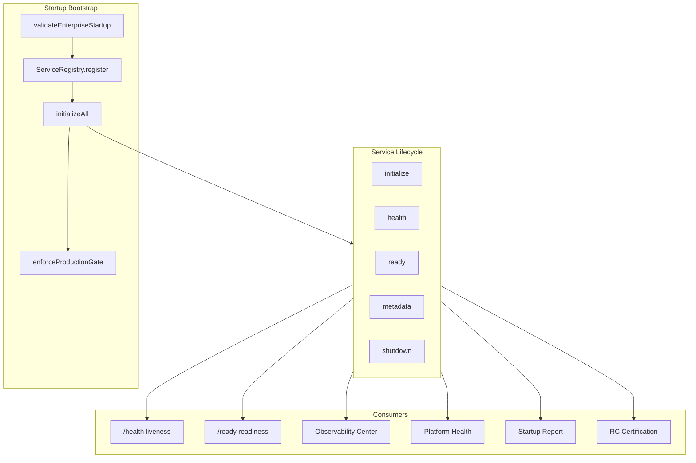
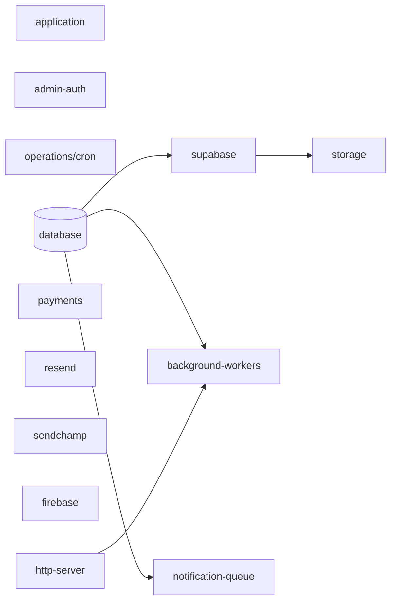

# Enterprise Service Registry & Dependency Lifecycle

BamSignal centralizes every external integration in a **Service Registry** with a standard lifecycle. Health, readiness, observability, and shutdown all consume registry state — no duplicated checks.

## Architecture



## Service dependency graph



## Registered services

| ID | Label | Tier | Shutdown priority |
|----|-------|------|-------------------|
| database | Postgres | critical | 100 |
| supabase | Supabase | critical | 200 |
| application | Application URL | critical | — |
| payments | Paystack | critical | — |
| admin-auth | Command Center | critical | — |
| operations | Cron & Diagnostics | critical | — |
| storage | Photo Storage | important | — |
| resend | Resend Email | important | — |
| sendchamp | Sendchamp WhatsApp | important | — |
| firebase | Firebase Push | important | — |
| google-calendar | Google Calendar | optional | — |
| zoom | Zoom | optional | — |
| google-meet | Google Meet | optional | — |
| openai | OpenAI | optional | — |
| telegram | Telegram | optional | 900 |
| background-workers | Rate-limit retention | runtime | 800 |
| notification-queue | Notification queue | runtime | 750 |
| http-server | HTTP | runtime | 1000 |

## Standard lifecycle

Every service implements:

| Method | Purpose |
|--------|---------|
| `initialize()` | Connect clients, start workers — **never at import time** |
| `health()` | Runtime probe; updates metrics |
| `ready()` | Contributes to `/ready` when tier is critical |
| `shutdown()` | Release connections / stop workers |
| `metadata()` | Static integration metadata for observability |

## Feature states

| State | Meaning |
|-------|---------|
| **disabled** | Required env missing — optional services stay disabled without failing startup |
| **enabled** | Configured and healthy |
| **unavailable** | Configured but health/init failed |

## Startup sequence

1. `bootstrapStartupValidation()` — env tiers, register services (no init)
2. `runStartupMigrations()`
3. `bootstrapServiceRegistry()` — `initializeAll()` in dependency order
4. HTTP `listen()` — register http-server for shutdown
5. `registerGracefulShutdownHandlers()` — SIGTERM, SIGINT, fatal errors

## Graceful shutdown order

```
HTTP server
  ↓
Telegram polling
  ↓
Background workers (rate-limit retention)
  ↓
Notification queue (noop — inline processing)
  ↓
Postgres pool
```

## Metrics (per service)

- `initializationTimeMs`
- `startupDurationMs`
- `lastHealthCheckAt`
- `errorCount`
- `restartCount`
- `availability`

Exposed in detailed `/ready?details=1` (diagnostics) under `registry.services[].metrics`.

## Code locations

- `shared/serviceRegistry/ServiceRegistry.mjs` — core registry
- `server/services/serviceDefinitions.js` — BamSignal service adapters
- `server/services/serviceRegistry.js` — singleton bootstrap
- `server/services/gracefulShutdown.js` — ordered teardown
- `server/services/readiness.js` — `/ready` from registry
- `server/services/startupBootstrap.js` — validation + registry init

## Tests

```bash
npm run test:service-registry
npm run test:readiness-health
npm run test:server-import
```

See `scripts/test-service-registry.mjs` for the registry test report output.
