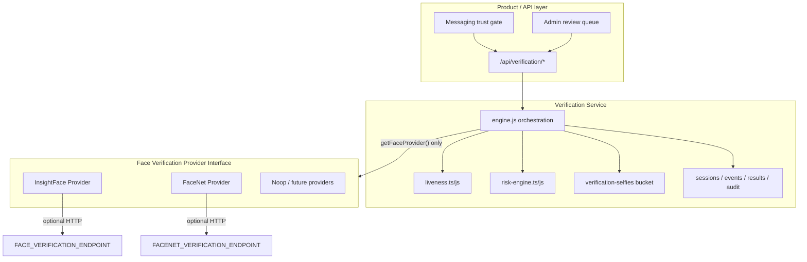

# National Production Verification System

## Architecture



**Rules**
- Application code never imports InsightFace/FaceNet SDKs.
- Only `getFaceProvider()` selects a concrete adapter.
- Embeddings never appear in API JSON to the browser.
- Provider swap = change `FACE_VERIFICATION_PROVIDER` (+ endpoint).

## Database schema

Tables (migration `0049_national_verification.sql`):

| Table | Purpose |
|-------|---------|
| `verification_sessions` | Per-attempt status, provider, scores, selfie path, messaging unlock |
| `verification_events` | Timeline (started, uploaded, verified, admin_decision) |
| `verification_results` | Latest liveness/match/trust decision + encrypted metadata |
| `verification_audit_logs` | Immutable admin/system audit trail |

Selfie binary objects live in private Supabase bucket `verification-selfies` (signed URLs for admins only).

## API

All member routes require Bearer auth + rate limits.

| Method | Path | Body | Result |
|--------|------|------|--------|
| POST | `/api/verification/start` | `{ deviceFingerprint? }` | `{ sessionId, status, challengeId, messagingUnlocked }` |
| POST | `/api/verification/upload` | `{ sessionId, selfieDataUrl }` | `{ status }` |
| POST | `/api/verification/verify` | `{ sessionId, selfieDataUrl, profilePhotos[], challengeResponse? }` | `{ status, thresholds }` |
| POST/GET | `/api/verification/status` | `{ sessionId? }` | `{ status }` |
| GET/POST | `/api/verification/admin` | `action=list\|approve\|reject\|request_new_selfie\|suspend` | queue / decision |

Public `status` never includes embeddings.

## Environment variables

| Variable | Default | Meaning |
|----------|---------|---------|
| `FACE_VERIFICATION_PROVIDER` | `insightface` | `insightface` \| `facenet` \| `noop` |
| `FACE_VERIFICATION_ENDPOINT` | — | Remote InsightFace-compatible service |
| `FACE_VERIFICATION_API_KEY` | — | Bearer for remote service |
| `FACENET_VERIFICATION_ENDPOINT` | — | Optional FaceNet endpoint |
| `FACE_MATCH_AUTO_VERIFY_MIN` | `95` | Auto unlock threshold |
| `FACE_MATCH_MANUAL_REVIEW_MIN` | `80` | Manual review floor |
| `FACE_MATCH_REQUIRED_FOR_MESSAGING` | `false` | National gate on (server) |
| `VITE_FACE_MATCH_REQUIRED_FOR_MESSAGING` | `false` | National gate on (client) |
| `VERIFICATION_METADATA_KEY` | falls back ADMIN_SECRET | AES key for metadata_enc |

## Business flow (enabled when face-match required)

Register → Email OTP → Profile → Photos → Browse → First message → SMS OTP → Live selfie → Liveness → Face match (provider) → Risk engine → Auto / Manual / Retry → Messaging unlocked

When `FACE_MATCH_REQUIRED_FOR_MESSAGING=false` (F&F default), SMS + selfie **submit** still unlocks messaging (existing launch gate).

## Testing checklist

- [ ] `node scripts/test-national-verification.mjs`
- [ ] `npm run test:server-import`
- [ ] `npm run build`
- [ ] Unauth `POST /api/verification/start` → 401
- [ ] Member start → session + challengeId
- [ ] Upload invalid image → 400
- [ ] Verify with noop provider → decision + no embedding in JSON
- [ ] Admin list returns signed selfie URL only
- [ ] Swap `FACE_VERIFICATION_PROVIDER=facenet` → same API contract
- [ ] Rate limit burst on verify → 429
- [ ] Messaging unlock respects national flag on/off

## Source layout

```
src/lib/verification/          # TS contracts + pure risk/liveness
server/lib/verification/       # Node runtime engine + providers
api/verification/              # HTTP handlers
migrations/0049_national_verification.sql
```
